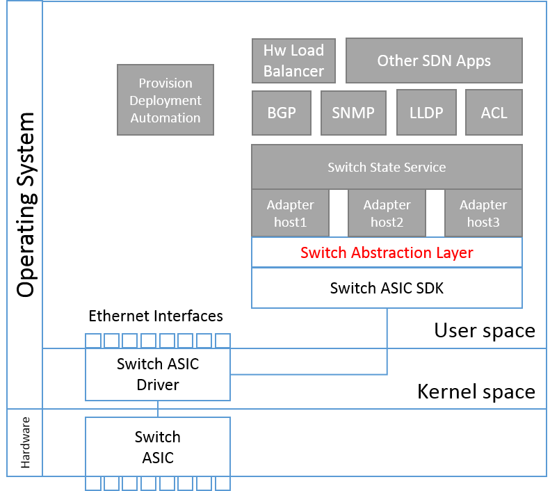

Switch Abstraction Interface v0.9.2

**Authors**
- **Microsoft**: Dmitry Malloy, Dave Maltz, CJ Williams
- **Dell**: Arun Subash Manickam, Ashok Daparthi, Clifford Wichmann, Mike Lazar, Sanjay Sane
- **Facebook**: Omar Baldonado, Tian Fang, Adam Simpkins
- **Broadcom**: Ben Gale
- **Intel**: Uri Cummings, Dan Daly, and Miles Penner
- **Mellanox**: Matty Kadosh, Itai Baz and Aviad Raveh

Contents

[TOC]

# List of Changes

Version  | Changes | Name | Date 
-------- | ------- | ---- | -----
0.9      | Initial Draft | | 2014/10/06
0.9.1    | Remove header files from the doc, plus various changes based on OCP inputs | | 2014/12/31
0.9.2    | Update doc to match v0.9.2 | | 2015/05/01

# License
© 2014 Microsoft Corporation, Dell Inc., Facebook, Inc, Broadcom Corporation, Intel Corporation, Mellanox
Technologies Ltd.

As of September 9, 2014, the following persons or entities have made this Specification available under the Open
Web Foundation Final Specification Agreement (OWFa 1.0), which is available at
http://www.openwebfoundation.org/legal/the-owf-1-0-agreements/owfa-1-0
Microsoft Corporation, Dell Inc., Facebook, Inc, Intel Corporation, Mellanox Technologies Ltd.

You can review the signed copies of the Open Web Foundation Agreement Version 1.0 for this Specification at
http://opencompute.org/licensing/, which may also include additional parties to those listed above.

Your use of this Specification may be subject to other third party rights. THIS SPECIFICATION IS PROVIDED "AS IS." The contributors expressly disclaim any warranties (express, implied, or otherwise), including implied warranties of merchantability, noninfringement, fitness for a particular purpose, or title, related to the Specification. The entire risk as to implementing or otherwise using the Specification is assumed by the Specification implementer and user. IN NO EVENT WILL ANY PARTY BE LIABLE TO ANY OTHER PARTY FOR LOST PROFITS OR ANY FORM OF INDIRECT, SPECIAL, INCIDENTAL, OR CONSEQUENTIAL DAMAGES OF ANY CHARACTER FROM ANY CAUSES OF ACTION OF ANY KIND WITH RESPECT TO THIS SPECIFICATION OR ITS
GOVERNING AGREEMENT, WHETHER BASED ON BREACH OF CONTRACT, TORT (INCLUDING NEGLIGEN CE), OR OTHERWISE, AND WHETHER OR NOT THE OTHER PARTY HAS BEEN ADVISED OF THE POSSIBILITY OF SUCH DAMAGE.

THE FOLLOWING IS A LIST OF MERELY REFERENCED TECHNOLOGY: Microprocessor technology, semiconductor manufacturing technology, operating system technology (including without limitation networking operating system technology), emulation technology, graphics technology, video technology, integrated circuit packaging technology and the like, compiler technologies, object oriented technology, optical/RF communications technology including chip I/O and driver technology, bus technology, memory chip technology (including, without limitation, NAND memory, NOR memory, resistive RAM (RRAM), seek scan probe (SSP) memory, nonvolatile memory (including without limitation, memory based on chalcogenide materials, phase change memory (PCM), one or more stacked layers of memory cells, embedded PCM memories, non-volatile cache memory, solid state
drives, SRAM, embedded DRAM, ferro-electric memory, and polymer memory)) and/or health-related and medical technology. IMPLEMENTATION OF THESE TECHNOLOGIES MAY BE SUBJECT TO THEIR OWN LEGAL TERMS.

# Introduction
This specification defines a Switch Abstraction Interface (SAI) for forwarding elements, such as switching ASICs, NPU and software switch. The SAI API is designed to provide a vendor-independent way of controlling forwarding elements like hardware ASIC or NPU in a uniform manner. This specification also allows exposing vendor-specific functionality and extensions to existing features.

# Intended audience
This document is intended primarily for the programmers who plan to use, develop or extend the SAI.

# Definitions
**Adapter** is a pluggable code module that implements SAI for a given forwarding element.

**Control stack** is a set of software components that represents the host and callers of SAI, and provides higher level programming support to network control applications.

**Adapter host** is a software component that loads the adapter and exposes its functionality to the other part of the Control stack.
 
**Forwarding Element** is the implementation of a network forwarding plane that a given instance of an SAI Adapter adapts to. For instance this could be a switch chip, NPU or software switch.

# High-Level design notes
An Adapter is a driver that implements the SAI service layer for a given forwarding element, and is typically (though not necessarily) provided with that element. This Adapter is responsible for discovery and binding to the underlying forwarding element, including loading or attaching to whatever other sub-modules it requires.

Adapters are intended to be as simple as possible, holding no configuration, and only the state received from the Control stack and the forwarding element required to accomplish it's task. Our design strives to push the bookkeeping complexity from Adapter into the Control stack wherever possible.

The Adapter module is loaded into a hosting process ("Adapter Host") and then initialized. During initialization the Adapter initiates discovery process of the specified instance of a switching entity. A switching entity is a top-level object in this API.

There could be multiple Adapter Hosts running at the same time. Each Adapter Host is responsible for managing a portion of functions within the forwarding element. For example, an IP routing Adapter Host is responsible for syncing IP routes to the forwarding element, while a counter Adapter Host is responsible for reading counters from the forwarding element.

Key assumptions, design decisions and API semantic clarifications:
- CRUD (Create/Read/Update/Delete) based API to manage the SAI objects.
- Adapter is not the source of the critical persisted state. It can crash or be shut down and the Control stack will be able to recover from such an event.
- If specific attributes are required for SAI object, but not specified as part of the create function, then the Adapter should choose an appropriate default if it can, or fail if it cannot.
- Deletion of an object that is referenced should fail (e.g. removal of router when interface exist). 

__Figure 1: SAI in a plausible switch system architecture__

# API description
The SAI interface provides a programmatic abstraction of a network forwarding element. Its purpose is to allow the Control stack clients of the interface to be written independently from the forwarding element.

The API is designed to be OS-agnostic (*nix/Windows/etc)

The API is attribute-based to minimize compatibility issues with versioning of structures and to allow API extensibility.

The API is a collection of C-style interfaces exposed from the Adapter. These interfaces are grouped into three categories:

- Mandatory functionality. This is a set of "core" APIs for the basic forwarding operations required by the Control stack. All Adapter Implementations must support these functions. The Control stack will fail the loading of the Adapter if any of these functions are missing.

- Optional functionality. This is the set of additional functions that are defined for, but not required, in a compliant SAI Adapter implementation. They enable non-core forwarding functionality in a standard manner. They are only required by Control stack implementations that use them. The Control stack should not necessarily assume that the functions are present in the Adapter (although may choose to do so)."

- Custom functionality: This is the set of additional functions that are neither defined nor required for an compliant SAI Adapter implementation. They are used for Adapter-specific extensions to SAI, most typically to expose differentiated functionality in the underlying forwarding element. Associated support is required in the Control stack to access these functions. A more generic framework for exposing such functionality through custom attribute definition will be defined in a future draft.

APIs are discovered by querying for method tables through the mechanism described in "Functionality query" section.

# Adapter startup/shutdown sequence

The Adapter host is configured with the information required to load and initialize the Adapter during startup.

After the Adapter is loaded, the Adapter host acquires addresses of the three well-known functions: `sai_api_initialize()`, `sai_api_query()` and `sai_api_uninitialize()`.

The Adapter is first initialized with a call to `sai_api_initialize()`. Through this the Adapter is passed a method table of services provided by the Adapter host. Forwarding element initialization is not performed in this function - the purpose is software initialization of the driver. After this, the Adapter can be queried for the SAI operational method tables."

After initialization, `sai_api_query()` can be used for retrieval of various methods tables for SAI functionalities.

SAI is a managed API, with versioning support to allow for a level of backward compatibility. If the signature or sematics of a function needs to change then a new function (with unique ID) should be created, leaving the prior version unchanged. The new ID is an enumeration name that encodes the version (e.g. SAI_API_VLAN2). The Adapter host starts inquiry with the latest version that it knows about, and then works back until it finds an available function in the Adapter. If none are found then the function is deemed to be not supported, and the Adapter host reacts accordingly.

Once all mandatory functionalities are successfully queried, optional functionalities are requested. Failure to discover optional functionality does not necessarily (though may) lead to a failure of the system startup.

After all the functionalities being retrieved, Adapter Host proceeds to use the Adapter operations.

For example, first method that Adapter Host calls is `sai_initialize_switch()` that performs full forwarding element initialization. In a system where there are multiple Adapter Hosts, only one of them calls the above function. Others will call `sai_connect_switch()` to connect to the Adapter once the Adapter has been initialized. The call to `sai_connect_switch()` will fail if the forwarding element hasn't been initialized. The `sai_intialize_switch()` function takes the following parameters:

- handle to a switch entity profile
- hardware id of that switch entity
- name of corresponding microcode
- callbacks table

The `profile_id` is used by the Adapter to retrieve a profile which is a list of key-value string pairs that contain vendor-defined settings. Once the Adapter has the profile id, it can use the function `profile_get_value()` and `profile_get_next_value()` from `service_method_table_t` to get the key-value string pairs, such as the `SDK_LIBRARY_PATH`, `NPU_CONFIG_FILE_PATH`. The `service_method_table_t` is provided by the Adapter host during `sai_api_intialize()`.

Format and contents of the "hardware id" string is defined by the vendor and contains enough information to identify and access the device. For example it can contain PCIe location.

Some Adapters may need to load a further different code object according to the details of the system and forwarding element. The microcode parameter allows such an object to be identified. Its format and meaning are Adapter dependent.

The function needs to discover the instance of the forwarding element using "hardware id" string, map devices registers, query information to determine specific silicon revision, and given the microcode and the profile settings, initialize the forwarding element.

After this, driver enters normal operations and starts to handle calls from Adapter Host to various methods of different functionality tables. It is important to note that during shutdown, Adapter Host will invoke `sai_switch_shutdown()`. This function should return the forwarding element to the externally-visible state that it was in before the `sai_switch_initialize()` call. That is, externally visible links should go down and no forwarding should occur. For Adapter Hosts which uses `sai_connect_switch()`, they will use `sai_disconnect_switch()` to disconnect from the Adapter.

`sai_api_uninitialize()` does the cleanup of anything that was done in `sai_api_initialize()` and is a last call to the Adapter before it's unloading.

Finally, Adapter Host unloads the Adapter module.

# Specification contents and timeline

For the list of accepted features please see the History section at the end of the specification. Summary of supported functionalities is given in the table below:

SAI API                   | Description                 | Category  | Version 
--------------------------|-----------------------------|-----------|--------
sai_switch_api_t          | Top-level switch object     | Mandatory | 0.9.1
sai_port_api_t            | Port management             | Mandatory | 0.9.1
sai_fdb_api_t             | Forwarding database         | Mandatory | 0.9.1
sai_vlan_api_t            | VLAN management             | Mandatory | 0.9.1
sai_vr_api_t              | Virtual router              | Mandatory | 0.9.1
sai_route_interface_api_t | Routing interface           | Mandatory | 0.9.1
sai_route_api_t           | Routing table               | Mandatory | 0.9.1
sai_neighbor_api_t        | Neighbor table              | Mandatory | 0.9.1
sai_next_hop_t            | Next hop table              | Mandatory | 0.9.1
sai_next_hop_api_t        | Next hop group              | Mandatory | 0.9.1
sai_qos_api_t             | Quality of service          | Mandatory | 0.9.1
sai_acl_api_t             | ACL management              | Mandatory | 0.9.1
sai_lag_api_t             | LAG                         | Mandatory | 0.9.2
sai_stp_api_t             | STP                         | Mandatory | 0.9.2
sai_host_interface_api_t  | Control packet send/receive | Mandatory | 0.9.2
sai_mirror_api_t          | Port mirroring              | Optional  | 0.9.2
sai_samplepacket_api_t    | Packet sampling             | Optional  | 0.9.2
sai_tunnel_api_t          | Tunneling                   | Optional  | TBD
sai_policer_api_t         | Policer                     | Optional  | TBD
sai_dcb_api_t             | Datacenter bridging         | Optional  | TBD
sai_openflow_api_t        | Openflow 1.x                | Optional  | TBD
sai_multicast_api_t       | L3 Multicast groups         | Optional  | TBD

# SAI Functional APIs

## SAI object and identifier

SAI defines a collection of APIs to create, delete, set and get attributes of SAI objects, such as port, lag, next hop, next hop groups. SAI objects are identified using either match key or object id. The upper application can use them to manage the object, i.e., set/get object attribute and delete object.

Match key is passed from upper application to SAI in the SAI create function call. SAI route, fdb entry and neighbor entry are identified via match keys. Duplicated match keys are not allowed. 

Object id (`sai_object_id_t`) is generated by SAI and then passed to user during the SAI create function calls. The object id can uniquely identify a SAI object. It can also be used as a reference to create association between two SAI objects, e.g., a SAI next hop object id referenced by a SAI route object.

> **Implementation note for `sai_object_id_t`:**

> - For a specific SAI object set/get attribute function call, the implementation needs to validate whether the SAI object passed to the function call is a correct type. For example, the next hop set attribute function call should return `SAI_STATUS_INVALID_OBJECT_TYPE` when a non next hop object passed to this call.
> - In terms of SAI object association, the attribute allows the application to pass any SAI object. It's up to each platform/implementation to determine whether such associate is feasible or not, and return success or `SAI_STATUS_INVALID_ATTR_VALUE_x` accordingly.
> - The possible implementation can be embed the SAI object type into the object id. For example, the implementation can use upper 16 bits as the object type and lower 48 bits as the object id. 
> - It can embed the object id returned by the vendor (usually `uint32_t`) into the lower 48 bits. 
> - Upper 16 bits allow the SAI to define 65536 SAI object types.

Since VLAN has well-defined range and user application need to explicitly specify the VLAN id, `sai_vlan_id_t` is given by user application instead of being allocated by SAI.

## Data Types (saitypes.h)

File contains cross-platform definitions for data types used in SAI.
- Defines cross-platform `sai_ip_address_t` as union of ipv4 and ipv6 addresses n network byte order.
- Defines cross-platform `sai_ip_prefix_t` as union of ipv4 and ipv4 prefixes.
- The `sai_mac_t` is defined as `uint8_t[6]` in network order with mac[0] to be the first byte of the mac address.
- `sai_attribute_value_t` is the value of all sai attributes. It is defined as a union of all base sai types defined in this header file. `sai_uint64_t u64` defined in the `sai_attribute_value_t` is used for all sai attribute values whose base type is `uint8_t`, `uint16_t`, `uint32_t` and `uint64_t`, whereas `sai_int64_t s64` is used for all values whose base type is `int8_t`, `int16_t`, `int32_t` and `int64_t`.

## Status codes (saistatus.h)
List of status codes returned from the SAI methods.

A number of attributes can be passed to the `create_sai_object` function where sai_object can be any sai_object such as router interface, next hop. In case the create function call fails due to attribute related errors such as invalid attribute, invalid attribute value, unsupported attribute, and unimplemented attribute, `saistatus.h` allows the return code to convey which attribute causes the error. The `saistatus.h` defines a base index and maximum index for all these four types of attribute related errors. When you get an error code that falls into their defined ranges, the offset from its corresponding base index denotes that attribute that causes the failure. For example, if you pass 5 attributes into a create_sai_object call, and the return code (rc) is 0x00010003. You can first use `SAI_STATUS_IS_INVALID_ATTRIBUTE(rc)` to determine if the error is due to invalid attribute or not. In this case, the answer is yes. Then, you can subtract the return code with `SAI_STATUS_INVALID_ATTRIBUTE_0` to get the offset. In this case, you will get 3 meaning the 4th attribute in the call is an invalid attribute.

## Functionality query (sai.h)
Adapter entry point to retrieve SAI APIs.

## Switch functionality (saiswitch.h)
This is a top-level object exposed from the Adapter. This switch object controls the switch level behavior such as cut-through or store-forward, ecmp hash configuration.

## Port functionality (saiport.h)
SAI port provides following functions:

- Provides physical port state manipulation as well as state (UP/DOWN) notifications.
- Obtain physical lane information for a SAI port
- Setup the lane mode for a SAI port

###	Application Port to SAI port mapping

Adapter Host usually has the notation of Application Port (App Port), which refers to the different ports that are used in the system like Front-Panel, Fabric. For front panel, it would be the actual physical location of the port in the box. SAI ports represent the switch logical ports that the Adapter Host can use. Since SAI port number is opaque to Adapter Host and different SAI implementation may choose its own numbering scheme, the Adapter Host needs to map an Application Port to a SAI port.

SAI switch attribute `SAI_SWITCH_ATTR_PORT_LIST` allows user to query a list of all SAI ports available in the system. SAI port attribute `SAI_PORT_ATTR_HW_LANE_LIST` allows user to query physical lane information of a SAI port. Since the Adapter Host has knowledge of physical lane information of an Application port based on the platform, the Adapter Host can associate an Application port with a SAI port using such physical lane information.

The physical lane information in a switching ASIC is defined as the lane number. Every ASIC has a numbering scheme to uniquely number every physical lane. For example, an ASIC has 128 physical lanes, and they can be numbered from 1 to 128.

#### Physical lane numbering

The Lane numbering will vary from vendor to vendor. The vendor should propose a mapping that would map their internal numbering based on the architecture to a 32 bit lane number. There are many ways to map, some suggestions are given below.

- Some ASICs may have fixed port and each lane may be represented by a hardware port. In that case the mapping is simple: `Lane Number = hardware Port`

- Some ASICs may have Port Blocks and lanes within port blocks. These may be serially increasing. In such cases the Lane number can be derived through a simple formula. In a 64 lane system we can have 16 port blocks numbered 0-15 and within each port block we can have internal lane numbers 1-4. We can have a simple formula to derive the lane number: `Lane Number = (Port Block Num * 4) + Internal Lane number`

- Some ASICs may have `<Block, Lane>` where Block, Lane are not increasing serially. For this we would have 24 or 16 bits allocated for Block and remaining for Lane and encode to 32 bit Lane number: `Lane Number = <HW Block (24 bits), Lane Number (8 bits)>`

### Setup Lane mode for a SAI port

A switch SAI port can correspond to a physical communication lane or multiple physical lanes. The switch allows user to bundle several physical lanes into one switch logical port (non-breakout mode), and can also unbundle them (Breakout mode). New SAI ports can be created during the breakout operation, and existing ports can be deleted during the un-breakout operation.

For lane breakout, the application can use `SAI_PORT_ATTR_BREAKOUT_MODE` to know current breakout mode and do a break out. As for the un-breakout operation, due to certain switching chip constraints, the application may needs extra information from the ASIC vendors to know exactly what lanes can be bundled together.

SAI switch attribute `SAI_SWITCH_ATTR_PORT_BREAKOUT` can be used to do the (un)breakout operations for a SAI port. `sai_port_event_notification_fn()` provides event notification to indicate such SAI port add/removal event. 

Before we do (un)breakout operations for a SAI port(s), the Adaptor Host should remove all the port settings on the SAI port(s) object and other objects like VLAN, FDB, L3, ACL, QOS, Sample packet, Mirror etc.

During SAI initialization, SAI notifies all available SAI ports though the port event notification.

## LAG functionality (sailag.h)

SAI LAG provides APIs to create, remove and update Link Aggregation Group (LAG) object. The create call return a LAG id which can be later used to manage the port membership of the LAG. The remove call destroy the LAG object. The `add_ports_to_lag()` and `remove_ports_from_lag()` adds and removes SAI port to and from the LAG. 

LAG is defined as a simple container for a group of the SAI ports. The LAG object only manages its port membership. All its member port attributes such as MTU, default VLAN are managed individually. The SAI applications need to be aware of the LAG membership and is responsible to keep a consistent view across all its member port attributes, for example all member ports should have same MTU and same default VLAN.

SAI, for a given set of member ports, should maintain the same flow-to-port mapping to the extent possible when the member ports gets deleted and added back given that the hash function for this LAG port is not changed.

## Forwarding Database (MAC Table) functionality (saifdb.h)
Provides FDB entries manipulation as well as aging/learning notifications.

## VLAN functionality (saivlan.h)
Provides VLAN management functions, such as VLAN creation deletion and port membership.

## STP functionality (saistp.h)

SAI STP provides APIs to create, remove and update Spanning-Tree Protocol (STP) instances. User can create a STP instance and then associate a VLAN or multiple VLANs to this STP instance. User can also set the Spanning-Tree port state for the STP instance. 

A default STP instance is created during SAI initialization phase. User can use `SAI_SWITCH_ATTR_DEFAULT_STP_INST_ID` to query the default STP instance. 

-	When a VLAN is created, it is associated to the default STP instance by default.
-	User can associate the VLAN to a non-default STP instance, and the VLAN is removed from the default STP instance.
-	A STP instance is not allowed to be deleted if it has VLAN’s associated. The user has to associate the VLAN’s to a new STP instance or default STP instance before deleting the STP instance
-	When a VLAN associated with a non-default STP instance is removed, it will also be removed from the STP instance

## Router functionality (sairouter.h)
Provides functions to manage virtual routers, such as creating and deleting virtual routers.

## Router Interface functionality (sairouterintf.h)
Provides "router interface" object. The router interface is attached a specific virtual router. It can be either VLAN-based or port-based router interface. You can also specify mac address for the router interface. However, if the forwarding element does not support per-router interface mac address, the mac address will inherit from the mac address from higher hierarchy such as virtual router or switch object.

## Route functionality (sairoute.h)
Provides IP routing table (FIB) management functions. When an IP packet is received, the forwarding element first determines if the packet is destined a certain router interface on the switch. If yes, then the forwarding element lookups its destination IP address in the IP routing table, and forwards the packet to a next hop or a next hop group.

## Neighbor functionality (saineighbor.h)
Provides the IP neighbor table management functions. IP neighbor defines a L3 neighbor that is within the same IP subnet as one of the router interface on the router. The IP neighbor is associated with a specific router interface, is assigned to a specific IP address, and has a mac address. IP neighbor also has a packet action attribute to decide whether to forward, drop or trap the IP packet which comes from a different router interface with destination IP matching the neighbor IP. The IP neighbor does not define the outgoing port as this can be resolved using the FDB table.

## Next Hop functionality (sainexthop.h)
Provides next hop objects such as IP next hop and IP tunnel next hop. Current version only has IP next hop defined. IP next hop must also be an IP neighbor. It defines an IP neighbor that a packet can be routed to. The user needs to create an IP neighbor before it creates an IP next hop. The sai associates them using the router interface ID and the IP address. The IP next hop is identified by a next hop ID which can be used in sai_route as well as other matching rules to forward traffic to an IP prefix to it. Intuitively, IP neighbor represents a device without any packet forwarding capability so that only traffic destined to its IP are forwarded to it, whereas IP next hop represents a device that can also forward other traffic. IP next hop is associated with a specific router interface, and is identified with an IP address.

## Next Hop Group functionality (sainexthopgroup.h)
Provides next hop group functions. A router can have many next hops. In case of unicast, a packet can be spread among a group of next hops. Next hop group contains a group of next hops.

## Host interface (saihostintf.h)

SAI host interface provides APIs to send and receive control plane traffic using different types of channels. It also defines the priority, bandwidth (allowed rate) and the burstiness for different types of control plane traffic.

SAI host interface is composed of three parts

- Traffic registration
- Traffic classification
- Packet send and receive

### Traffic registration
 
SAI assigns a unique identifier `trap_id` to each control traffic. There are three types of trap id: 

- Control protocol trap id: trap id for well-known control protocol, e.g. STP, OSPF.
- Pipeline exception trap id: trap id for an exception in the forwarding pipeline, e.g. packets with TTL=1, packets whose size exceeds the interface MTU. 
- User define trap id: application has the ability to extend and define additional control traffic trap id in order to support a new or proprietary control protocol or to define an additional exception in the switch pipeline. This capability is achieved by providing the ability to define trap-id via the switch-router pipeline, e.g. ACL, router.

Application can register to receive a trap_id. In addition, it can control the action to apply to the trap-id, options are: 

- Forward: forward the trap-id as a regular packet 
- Trap: terminate pipeline and send packet to CPU
- Log: sent a copy to the CPU, the original packet will continue the pipeline   
- Drop: drop the packet

### Traffic classification
  
SAI defines a QoS for control traffic, since in most cases a few trap ids share the same QoS attribute, and in order to reduce amount of configuration needed for system bring up. Multiple trap ids can be mapped into a single trap group which shares the priority, rate limiter and HW Traffic class.

###	Packet send and receive
  
SAI provides three different channels in order to send and receive packet from and to the CPU.

- OS network device: SAI receives (and sends) packets via the OS network device infrastructure, so that standard application such as Quagga can use socket to send and receive packets as it is. SAI can create these net devices whether they represent a physical port or a L3 router interface. On RX, the driver demux the packet to the corresponding net device according to incoming port / RIF ID. On TX, the application chooses which net device to use.
 
- OS file descriptor: SAI provides APIs to receive (and send) packets via an OS file descriptor. The APIs allow get and set meta data for packet receiving and sending. 

- send call and receive callback: SAI provides APIs to send packets and receive packets via callback functions via the SAI library.

## ACL functionality (saiacl.h)
Provides generalized Access Control Lists management functions. The ACL contains three types of objects, ACL table, ACL entry and ACL counter. The ACL table contains a number of ACL entries. Each ACL table defines a set of unique matching fields for all its ACL entries. A packet can match rules in different ACL tables and take non-conflicting actions from all the matched rules. However, within an ACL table, if a packet matches multiple rules, only the actions from the rule of highest priority are executed. ACL counters can also be created and attached to an ACL entry in order to counter the number of packets or bytes that match the ACL entry.

## Quality of Service functionality (saiqos.h)
Provides QoS functions. Manages the port scheduling mechanisms and CoS mapping.

## Mirror functionality (saimirror.h)

SAI mirror object provides APIs to create, remove and update mirror object. The APIs allow user to create a SAI mirror object which defines the mirror destination, and then allow user to attach this mirror object to various source SAI objects, such as port and ACL. 

Three types of mirror destination are supported, i.e., local, remote (RSPAN), and enhanced remote (ERSPAN). For local mirror, the ASIC mirrors the packets to a local port. For RSPAN, the switch adds a VLAN tag to the mirrored packet as it egresses its local mirror port. For ERSPAN, the switch adds an encapsulation header as it egresses its local mirror port.

There are several ways to specify the mirroring source packets. When attaching the SAI mirror object to a SAI port, all packets that go into this port or come out of this port are mirrored. Flow-based mirroring allows user to use ACL to specify the packets to mirror. 

## SamplePacket functionality (saisamplepacket.h)

SAI samplepacket object provides APIs to create, remove and update samplepacket object. The APIs allow user to create a SAI samplepacket object which defines the sampling rate and destination, and then allows user to attach this sample object to various source SAI objects, such as port, ACL. 

Only local CPU as sample destination is supported in current spec. All the sampled packets go to local CPU which is directly attached to the ASIC.

There are several ways to specify the sampling source streams. When attaching the SAI samplepacket object to a SAI port, all packets that go into this port or come out of this port are sampled. Flow-based mirroring allows user to use ACL to specify the packets to sample.

A samplepacket object is a sampler. Packets go into this sampler and gets sampled based on its configured sample rate. You can feed different streams of packets into this sampler. If the different streams have overlapping packets, the overlapped packets are treated as one packet in the sampler. You can create different samplepacket objects. Each of them corresponds to an independent sampler. A packet can be feed to different samplers. The sampling process in different samplers are independent.
