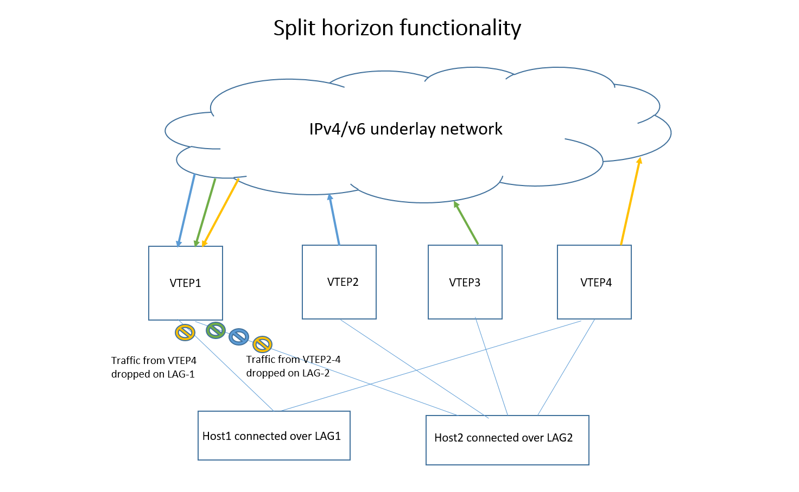
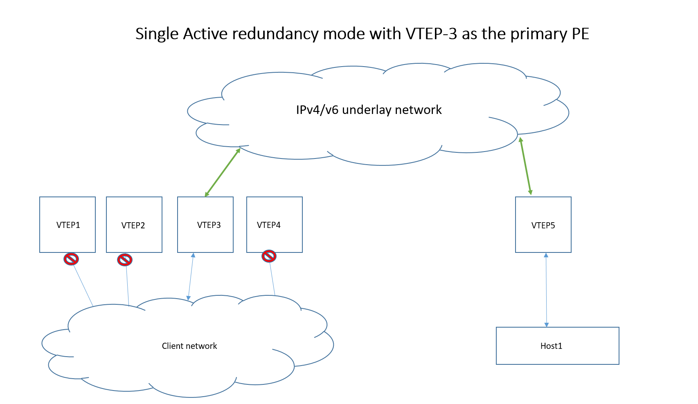

#  EVPN VxLAN Multihoming
-------------------------------------------------------------------------------
 Title       | SAI support for EVPN VxLAN Multihoming
-------------|-----------------------------------------------------------------
 Authors     | Jai Kumar, Rajesh Sankaran, Broadcom Inc.
 Status      | In review
 Type        | Standards track
 SAI-Version | 1.16
-------------------------------------------------------------------------------

# Table of Contents

- [List of Tables](#List-of-Tables)
- [Revision](#Revision)
- [1.0 Introduction](#10-introduction)
  - [1.1 Acronyms](#11-acronyms)
- [2.0 EVPN MH Requirements](#20-evpn-mh-sai-requirements)
- [3.0 EVPN MH SAI Components](#30-evpn-mh-sai-components)
  - [3.1 New SAI objects](#31-new-sai-objects)
  - [3.2 Changes to existing SAI objects](#32-changes-to-existing-sai-objects)
- [4.0 Sample Workflows](#40-sample-workflow)
  - [4.1 Known unicast MAC workflow](#41-known-unicast-workflow)
  - [4.2 Split horizon workflow](#42-split-horizon-workflow)
  - [4.3 DF Workflow](#43-df-workflow)
  - [4.4 Fast failover workflow](#44-fast-failover-workflow)
  - [4.5 Single Active Redundancy workflow](#45-single-active-redundancy-workflow)


# Revision

| Rev  | Date       | Authors                                          | Change Description |
| ---- | ---------  | ------------------------------------------------ | ------------------ |
| 0.1  | Sep 23' 2024   | Jai Kumar, Rajesh Sankaran                   | Initial draft  |
| 0.2  | Oct 23' 2024   | Rajesh Sankaran                              | Changed DF, single active attributes |


# 1.0  Introduction

This document describes the SAI changes required for supporting EVPN Multihoming based on [RFC 7432](https://datatracker.ietf.org/doc/html/rfc7432) and [RFC 8365](https://datatracker.ietf.org/doc/html/rfc8365).

RFC 7432 describes EVPN-MH support for MPLS networks and RFC 8365 describes the support for overlay networks like VxLAN.
The scope of this document is EVPN MH support for VxLAN networks.
 
## 1.1 Acronyms

| Acronym   | Description      |
|:----------|:----------|
| BUM      | Broadcast, Unknown unicast, Multicast     |
| DF       | Designated Forwarder                      |
| ES       | Ethernet Segment                          |
| EVPN     | Ethernet Virtual Private Network          |
| MH       | Multihoming                               |
| VNI      | Virtual Network Identifier                |
| VTEP     | VXLAN Tunnel End point                    |


# 2.0 EVPN-MH SAI Requirements

1. It shall be possible to create/delete a group of remote VTEPs.
2. It shall be possible to add/remove a remote VTEP to the remote VTEP group.
3. It shall be possible to create MAC addresses with the destination as the remote VTEP group. 
4. It shall be possible to set the MAC address destination as a remote VTEP group.
5. It shall be possible to implement the DF functionality at a per port basis. 
6. It shall be possible to implement the split horizon functionality as described in RFC 7432.
8. It shall be possible to implement single active redundancy mode as described in RFC 7432.
7. It shall be possible to implement a fast failover in the event of an ES going down.

# 3.0 EVPN-MH SAI Components

## 3.1 New SAI Objects 
No new SAI objects are introduced as part of this design.

## 3.2 Changes to Existing SAI Objects

### 3.2.1 Remote VTEP group support

A new nexthop group type to allow for MACs to point to the remote VTEP group is added.

```
typedef enum _sai_next_hop_group_type_t
...
    /** Next hop group is for bridge port */
    SAI_NEXT_HOP_GROUP_TYPE_BRIDGE_PORT,

} sai_next_hop_group_type_t;
```

A new nexthop type which will be part of groups of the above group type.

```
typedef enum _sai_next_hop_type_t
...
    /** Next hop group is for bridge port */
    SAI_NEXT_HOP_TYPE_BRIDGE_PORT,
} sai_next_hop_type_t;
```

The above nexthop type will need ATTR_TUNNEL_ID as well as ATTR_IP as mandatory parameters on creation.

```
typedef enum _sai_next_hop_attr_t
...
    /**
     * @brief Next hop entry IPv4 address
     *
     * @type sai_ip_address_t
     * @flags MANDATORY_ON_CREATE | CREATE_ONLY
     * @condition SAI_NEXT_HOP_ATTR_TYPE == SAI_NEXT_HOP_TYPE_IP or SAI_NEXT_HOP_ATTR_TYPE == SAI_NEXT_HOP_TYPE_MPLS or SAI_NEXT_HOP_ATTR_TYPE == SAI_NEXT_HOP_TYPE_TUNNEL_ENCAP or SAI_NEXT_HOP_ATTR_TYPE == SAI_NEXT_HOP_TYPE_BRIDGE_PORT
     */
    SAI_NEXT_HOP_ATTR_IP,


    /**
     * @brief Next hop entry tunnel-id
     *
     * @type sai_object_id_t
     * @flags MANDATORY_ON_CREATE | CREATE_ONLY
     * @objects SAI_OBJECT_TYPE_TUNNEL
     * @condition SAI_NEXT_HOP_ATTR_TYPE == SAI_NEXT_HOP_TYPE_TUNNEL_ENCAP or SAI_NEXT_HOP_ATTR_TYPE == SAI_NEXT_HOP_TYPE_SRV6_SIDLIST or SAI_NEXT_HOP_ATTR_TYPE == SAI_NEXT_HOP_TYPE_BRIDGE_PORT
     */
    SAI_NEXT_HOP_ATTR_TUNNEL_ID,
...
```

New Bridge-port of type next-hop group is introduced for FDB entries to point to the group of remote VTEPs.

```
typedef enum _sai_bridge_port_type_t
...
    /** Bridge nexthop group port */

    /** Nexthop group should be of type bridge port */
    SAI_BRIDGE_PORT_TYPE_BRIDGE_PORT_NEXT_HOP_GROUP,
} sai_bridge_port_type_t;
```

The Bridge-port of type next-hop group should have next-hop group ID attribute set.
```
typedef enum _sai_bridge_port_attr_t
{
...
    /**
     * @brief Associated nexthop group id
     *
     * @type sai_object_id_t
     * @flags MANDATORY_ON_CREATE | CREATE_ONLY
     * @objects SAI_OBJECT_TYPE_NEXT_HOP_GROUP
     * @condition SAI_BRIDGE_PORT_ATTR_TYPE == SAI_BRIDGE_PORT_TYPE_BRIDGE_PORT_NEXT_HOP_GROUP
     */
    SAI_BRIDGE_PORT_ATTR_BRIDGE_PORT_NEXT_HOP_GROUP_ID,
...
}
```

### 3.2.2 Designated Forwarder support

A new bridgeport attribute defined to drop BUM traffic egressing the bridgeport. The default value of this 
will be false. 
Note: Traffic dropped due to this should not be counted against SAI_PORT_STAT_IF_OUT_DISCARDS i.e Interface Tx drop counters.

```
typedef enum _sai_bridge_port_attr_t
{
...

    /**
     * @brief Indicates if the bridge port is set to drop the Tunnel Terminated broadcast, unknown unicast and multicast traffic
     * When set to true, egress BUM traffic will be dropped
     *
     * @type bool
     * @flags CREATE_AND_SET
     * @default false
     * @validonly SAI_BRIDGE_PORT_ATTR_TYPE == SAI_BRIDGE_PORT_TYPE_PORT or SAI_BRIDGE_PORT_ATTR_TYPE == SAI_BRIDGE_PORT_TYPE_SUB_PORT or SAI_BRIDGE_PORT_ATTR_TYPE == SAI_BRIDGE_PORT_TYPE_TUNNEL
     */
    SAI_BRIDGE_PORT_ATTR_TUNNEL_TERM_BUM_TX_DROP,
```

To handle DF election per VLAN and when a dot1q bridge model is used the above attribute is defined as part of the Vlan Member. 
 
```
typedef enum _sai_vlan_member_attr_t
{
...

    /**
     * @brief Indicates if the bridge port is set to drop the Tunnel terminated broadcast, unknown unicast and multicast traffic
     * When set to true, egress BUM traffic will be dropped
     *  
     * Valid only when the SAI_VLAN_MEMBER_ATTR_BRIDGE_PORT_ID is of type SAI_BRIDGE_PORT_TYPE_PORT.
     * 
     * @type bool
     * @flags CREATE_AND_SET
     * @default false
     * 
     */
    SAI_VLAN_MEMBER_ATTR_TUNNEL_TERM_BUM_TX_DROP,

```

### 3.2.3 Split Horizon support

  - Tunnels of peer mode SAI_TUNNEL_PEER_MODE_P2P are only considered here. 
  - The isolation group object of type SAI_ISOLATION_GROUP_TYPE_BRIDGE_PORT is used to achieve the split horizon functionality.
  - There is no change to the Isolation group and group member definition.
  - Bridgeport of type SAI_BRIDGE_PORT_TYPE_TUNNEL will have the isolation group attribute set.
  - The isolation group members will be the client side bridge ports of type SAI_BRIDGE_PORT_TYPE_PORT which share the ESI with the peering VTEPs.

### 3.2.4 Fast Failover support

A new Bridge port attribute (for type SAI_BRIDGE_PORT_TYPE_PORT) is introduced to specify the protection nexthop group ID.
When the Bridge port is down, all of the traffic to the Bridge port is redirected to the protection nexthop group.

```
typedef enum _sai_bridge_port_attr_t
{
...
    /**
     * @brief Associated protection bridge port nexthop group id
     *
     * The Protection nexthop group type should be SAI_NEXT_HOP_GROUP_TYPE_BRIDGE_PORT
     *
     * @type sai_object_id_t
     * @flags CREATE_AND_SET
     * @objects SAI_OBJECT_TYPE_NEXT_HOP_GROUP
     * @allownull true
     * @default SAI_NULL_OBJECT_ID
     */
    SAI_BRIDGE_PORT_ATTR_BRIDGE_PORT_PROTECTION_NEXT_HOP_GROUP_ID,

    /**
     * @brief Trigger a switch-over from primary to backup next hop
     *
     * @type bool
     * @flags CREATE_AND_SET
     * @default false
     * @validonly SAI_BRIDGE_PORT_ATTR_TYPE == SAI_BRIDGE_PORT_TYPE_PORT
     */
    SAI_BRIDGE_PORT_ATTR_BRIDGE_PORT_SET_SWITCHOVER
...
}
```

### 3.2.5 Single Active Redundancy Mode support

Single Active redundancy mode requires unicast and BUM traffic to be dropped in the ingress and egress directions
on the client port.

The following 4 parameters should be set to true to achieve the traffic drop.

```
typedef enum _sai_bridge_port_attr_t
{
...

    /**
     * @brief Indicates if the bridge port is set to drop the ingress traffic
     * When set to true, all ingress traffic will be dropped
     *
     * @type bool
     * @flags CREATE_AND_SET
     * @default false
     * @validonly SAI_BRIDGE_PORT_ATTR_TYPE == SAI_BRIDGE_PORT_TYPE_PORT or SAI_BRIDGE_PORT_ATTR_TYPE == SAI_BRIDGE_PORT_TYPE_SUB_PORT or SAI_BRIDGE_PORT_ATTR_TYPE == SAI_BRIDGE_PORT_TYPE_TUNNEL
     */
    SAI_BRIDGE_PORT_ATTR_RX_DROP,

    /**
     * @brief Indicates if the bridge port is set to drop the egress traffic
     * When set to true, all egress traffic will be dropped
     *
     * @type bool
     * @flags CREATE_AND_SET
     * @default false
     * @validonly SAI_BRIDGE_PORT_ATTR_TYPE == SAI_BRIDGE_PORT_TYPE_PORT or SAI_BRIDGE_PORT_ATTR_TYPE == SAI_BRIDGE_PORT_TYPE_SUB_PORT or SAI_BRIDGE_PORT_ATTR_TYPE == SAI_BRIDGE_PORT_TYPE_TUNNEL
     */
    SAI_BRIDGE_PORT_ATTR_TX_DROP,
...
}
```

To handle Single Active redundancy PE per VLAN and when a dot1q bridge model is used the above attribute is defined as part of the Vlan Member. 
 
```
typedef enum _sai_vlan_member_attr_t
{
...

   /**
     * @brief Indicates if all ingress traffic for this vlan member will be dropped.
     * When set to true, ingress traffic will be dropped
     *  
     * Valid only when the SAI_VLAN_MEMBER_ATTR_BRIDGE_PORT_ID is of type SAI_BRIDGE_PORT_TYPE_PORT.
     * 
     * @type bool
     * @flags CREATE_AND_SET
     * @default false
     * 
     */
    SAI_VLAN_MEMBER_ATTR_RX_DROP,

   /**
     * @brief Indicates if all egress traffic for this vlan member will be dropped.
     * When set to true, egress unicast traffic will be dropped
     *  
     * Valid only when the SAI_VLAN_MEMBER_ATTR_BRIDGE_PORT_ID is of type SAI_BRIDGE_PORT_TYPE_PORT.
     * 
     * @type bool
     * @flags CREATE_AND_SET
     * @default false
     * 
     */
    SAI_VLAN_MEMBER_ATTR_TX_DROP,

```


# 4.0 Sample Workflow

This section describes the SAI object usage for different EVPN MH scenarios.


## 4.1 Known Unicast workflow


__Figure 1: Known Unicast Packet Flow__

At VTEP5 the following objects are created.

  - tnl_oid_1-tnl_oid_4 of type SAI_OBJECT_TYPE_TUNNEL corresponding to tunnels created to VTEP1-VTEP4.

```
    sai_attribute_t attr;
    std::vector<sai_attribute_t> tunnel_attrs;

    attr.id = SAI_TUNNEL_ATTR_TYPE;
    attr.value.s32 = SAI_TUNNEL_TYPE_VXLAN;
    tunnel_attrs.push_back(attr);

    attr.id = SAI_TUNNEL_ATTR_PEER_MODE;
    attr.value.s32 = SAI_TUNNEL_PEER_MODE_P2P;
    tunnel_attrs.push_back(attr);

    attr.id = SAI_TUNNEL_ATTR_ENCAP_DST_IP;
    attr.value.ipaddr = vtep1_ip; 
    tunnel_attrs.push_back(attr);

    sai_status_t status = sai_tunnel_api->create_tunnel(
                                &tnl_oid_1,
                                gSwitchId,
                                static_cast<uint32_t>(tunnel_attrs.size()),
                                tunnel_attrs.data()
                          );

    /* create_tunnel for vtep2_ip to vtep4_ip */
    ..................
    ..................

```
  
  - nh_oid_1 to nh_oid_4 of type SAI_OBJECT_TYPE_NEXT_HOP corresponding to tunnels (tnl_oid_1-tnl_oid_4)

```
    std::vector<sai_attribute_t> next_hop_attrs;
    sai_attribute_t next_hop_attr;

    next_hop_attr.id = SAI_NEXT_HOP_ATTR_TYPE;
    next_hop_attr.value.s32 = SAI_NEXT_HOP_TYPE_BRIDGE_PORT;
    next_hop_attrs.push_back(next_hop_attr);

    next_hop_attr.id = SAI_NEXT_HOP_ATTR_IP;
    next_hop_attr.value.ipaddr = vtep1_ip;
    next_hop_attrs.push_back(next_hop_attr);

    next_hop_attr.id = SAI_NEXT_HOP_ATTR_TUNNEL_ID;
    next_hop_attr.value.oid = tnl_oid_1;
    next_hop_attrs.push_back(next_hop_attr);

    sai_status_t status = sai_next_hop_api->create_next_hop(&nh_oid_1, gSwitchId,
                                            static_cast<uint32_t>(next_hop_attrs.size()),
                                            next_hop_attrs.data());

    /* create_next_hop for vtep2_ip/tnl_oid_2 to vtep4_ip/tnl_oid_4 */
    ..................
    ..................

```


  - nh_grp_oid_1 of type SAI_OBJECT_TYPE_NEXT_HOP_GROUP for the remote VTEP group (VTEP1-4)

```
    sai_attribute_t nhg_attr;
    vector<sai_attribute_t> nhg_attrs;

    nhg_attr.id = SAI_NEXT_HOP_GROUP_ATTR_TYPE;
    nhg_attr.value.s32 = SAI_NEXT_HOP_GROUP_TYPE_BRIDGE_PORT;
    nhg_attrs.push_back(nhg_attr);

    sai_object_id_t nh_grp_oid_1;
    sai_status_t status = sai_next_hop_group_api->create_next_hop_group(&nh_grp_oid_1,
            gSwitchId,
            (uint32_t)nhg_attrs.size(),
            nhg_attrs.data());

```
  - nh_grp_oid_1 has members nh_grp_mbr_oid_1 to 4

```
    vector<sai_attribute_t> nhgm_attrs;
    sai_attribute_t nhgm_attr;

    nhgm_attr.id = SAI_NEXT_HOP_GROUP_MEMBER_ATTR_NEXT_HOP_GROUP_ID;
    nhgm_attr.value.oid = nh_grp_oid_1;
    nhgm_attrs.push_back(nhgm_attr);

    nhgm_attr.id = SAI_NEXT_HOP_GROUP_MEMBER_ATTR_NEXT_HOP_ID;
    nhgm_attr.value.oid = nh_oid_1; 
    nhgm_attrs.push_back(nhgm_attr);

    status = sai_next_hop_group_api->create_next_hop_group_member(&nhgmbr_id_1, gSwitchId,
            (uint32_t)nhgm_attrs.size(),
            nhgm_attrs.data());

    /* create_next_hop_group_member for nh_oid_2 to 4 */
    ..................
    ..................

```

  - bp_nh_grp_1_oid of type SAI_OBJECT_TYPE_BRIDGE_PORT with nexthop group pointing to nh_grp_oid_1

```
      sai_attribute_t attr;
      vector<sai_attribute_t> attrs;

      attr.id = SAI_BRIDGE_PORT_ATTR_TYPE;
      attr.value.s32 = SAI_BRIDGE_PORT_TYPE_NEXT_HOP_GROUP;
      attrs.push_back(attr);

      attr.id = SAI_BRIDGE_PORT_ATTR_BRIDGE_PORT_NEXT_HOP_GROUP_ID;
      attr.value.oid = nh_grp_oid_1;
      attrs.push_back(attr);

      attr.id = SAI_BRIDGE_PORT_ATTR_BRIDGE_ID;
      attr.value.oid = m_default1QBridge;
      attrs.push_back(attr);

      attr.id = SAI_BRIDGE_PORT_ATTR_ADMIN_STATE;
      attr.value.booldata = true;
      attrs.push_back(attr);

      attr.id = SAI_BRIDGE_PORT_ATTR_FDB_LEARNING_MODE;
      attr.value.s32 = SAI_BRIDGE_PORT_FDB_LEARNING_MODE_DISABLE; 
      attrs.push_back(attr);

      status = sai_bridge_api->create_bridge_port(&bp_nh_grp_1_oid, gSwitchId, 
                                                  (uint32_t)attrs.size(), attrs.data());
```

  - mac_host2 pointing to bp_nh_grp_1_oid

```
        
            sai_fdb_entry_t fdb_entry;
 
            fdb_entry.switch_id = gSwitchId;
            memcpy(fdb_entry.mac_address, mac_host2, sizeof(sai_mac_t));
            fdb_entry.bv_id = entry->bv_id;

            sai_attribute_t attr;
            vector<sai_attribute_t> attrs;

            attr.id = SAI_FDB_ENTRY_ATTR_TYPE;
            attr.value.s32 = SAI_FDB_ENTRY_TYPE_STATIC;
            attrs.push_back(attr);

            attr.id = SAI_FDB_ENTRY_ATTR_BRIDGE_PORT_ID;
            attr.value.oid = bp_nh_grp_1_oid;
            attrs.push_back(attr);

            attr.id = SAI_FDB_ENTRY_ATTR_ALLOW_MAC_MOVE;
            attr.value.booldata = true;
            attrs.push_back(attr);

            status = sai_fdb_api->create_fdb_entry(&fdb_entry, (uint32_t)attrs.size(), attrs.data());
```

## 4.2 Split Horizon workflow

  When Tunnel objects of peer mode type P2P are created, the isolation group objects can be re-used 
  to achieve the split horizon functionality and do not need the attributes being introduced as part of this
  PR. It is being elaborated here for completeness.


__Figure 2: Split Horizon Flow__

  At VTEP1 the following SAI objects with sub types are created.

  - SAI_OBJECT_TYPE_TUNNEL with peer mode as SAI_TUNNEL_PEER_MODE_P2P, tnl_oid_2-4 created for tunnels towards the peer multihoming VTEP2-4.
      Please refer to sec 4.1.
  - SAI_OBJECT_TYPE_BRIDGE_PORT of type SAI_BRIDGE_PORT_TYPE_TUNNEL, bp_tnl_oid_2-4 corresponding to tunnels as above. 
  - SAI_OBJECT_TYPE_BRIDGE_PORT of type SAI_BRIDGE_PORT_TYPE_PORT, bp_lag_oid_1-2 corresponding to client side LAGs 1,2.
  - SAI_OBJECT_TYPE_ISOLATION_GROUP of type SAI_ISOLATION_GROUP_TYPE_BRIDGE_PORT, isogrp_oid_2-4 corresponding to bp_tnl_oid_2-4 as above.
  - bp_tnl_oid_2-4 have SAI_BRIDGE_PORT_ATTR_ISOLATION_GROUP set as isogrp_oid_2-4 respectively.

```
    sai_attribute_t attr;
    attr.value.s32 = SAI_ISOLATION_GROUP_TYPE_BRIDGE_PORT;
    status = sai_isolation_group_api->create_isolation_group(&isogrp_oid_2, gSwitchId, 1, &attr);

    attr.id = SAI_BRIDGE_PORT_ATTR_ISOLATION_GROUP;
    attr.value.oid = isogrp_oid_2;
    status = sai_bridge_api->set_bridge_port_attribute(bp_tnl_oid_2, &attr);
 
    /* repeat for isogrp and bp_tnl_oid 3,4 */
    ............
    ............
```

  - Isolation Group member objects
    - SAI_OBJECT_TYPE_ISOLATION_GROUP_MEMBER isogrp_mbr_oid_22 corresponding to isogrp_oid_2+bp_lag_oid_2 ( Traffic from VTEP-2 will be dropped on LAG-2 )
    - SAI_OBJECT_TYPE_ISOLATION_GROUP_MEMBER isogrp_mbr_oid_32 corresponding to isogrp_oid_3+bp_lag_oid_2 ( Traffic from VTEP-3 will be dropped on LAG-2 )
    - SAI_OBJECT_TYPE_ISOLATION_GROUP_MEMBER isogrp_mbr_oid_41 corresponding to isogrp_oid_4+bp_lag_oid_1 ( Traffic from VTEP-4 will be dropped on LAG-1 )
    - SAI_OBJECT_TYPE_ISOLATION_GROUP_MEMBER isogrp_mbr_oid_42 corresponding to isogrp_oid_4+bp_lag_oid_2 ( Traffic from VTEP-4 will be dropped on LAG-2 )

```
        sai_object_id_t isogrp_mbr_oid_22 = SAI_NULL_OBJECT_ID;
        sai_attribute_t mem_attr[2];
        sai_status_t status = SAI_STATUS_SUCCESS;

        mem_attr[0].id = SAI_ISOLATION_GROUP_MEMBER_ATTR_ISOLATION_GROUP_ID;
        mem_attr[0].value.oid = isogrp_oid_2;
        mem_attr[1].id = SAI_ISOLATION_GROUP_MEMBER_ATTR_ISOLATION_OBJECT;
        mem_attr[1].value.oid = bp_lag_oid_2;

        status = sai_isolation_group_api->create_isolation_group_member(&isogrp_mbr_oid_22,
                                                                        gSwitchId, 2, mem_attr);
        /* Repeat for all combinations */
        .............
        .............
                                                                        
```


## 4.3 DF workflow


__Figure 3: Designated Forwarder Flow__

- DF settings
  - At VTEP1 lag_bp_oid for LAG is marked as NON_DF.
  - At VTEP2 lag_bp_oid for LAG is marked as NON_DF.
  - At VTEP4 lag_bp_oid for LAG is marked as NON_DF.

```
    sai_attribute_t attr;
    attr.id = SAI_BRIDGE_PORT_ATTR_TUNNEL_TERM_BUM_TX_DROP;
    attr.value.booldata  = true; /* false for vtep3 and true for vtep 1,2,4 */

    status = sai_bridge_api->set_bridge_port_attribute(lag_bp_oid, &attr);

```
 
## 4.4 Fast Failover workflow


__Figure 4: Failover Flow__


At VTEP1, the following objects are created.

  - For LAG-1, create NH,NHG, NHGMbr  objects as described in section 4.1 for known unicast.
    The remote member should be VTEP4.

  - For LAG-2, create NH,NHG, NHGMbr  objects as described in section 4.1 for known unicast.
    The remote member should be VTEP2-4.

  - Associate the Bridgeport of the LAG with the Bridgeport created in the above step.

```
    sai_attribute_t attr;
    attr.id = SAI_BRIDGE_PORT_ATTR_BRIDGE_PORT_PROTECTION_NEXT_HOP_GROUP_ID;
    attr.value.oid  = nhg_oid;    
    status = sai_bridge_api->set_bridge_port_attribute(bp_lag_oid, &attr);

    To effect the failover,
    attr.id = SAI_BRIDGE_PORT_ATTR_BRIDGE_PORT_SET_SWITCHOVER;
    att.value.booldata = true; /* false to revert to the primary LAG */
    status = sai_bridge_api->set_bridge_port_attribute(bp_lag_oid, &attr); 

```

  - FDB Entry set to point to the bp_lag_oid


## 4.5 Single Active Redundancy workflow


__Figure 5: Single Active Redundancy Flow__

- Bridgeport settings to achieve single active redundancy


```
    sai_attribute_t attr;
    attr.id = SAI_BRIDGE_PORT_ATTR_TX_DROP;
    attr.value.booldata  = true; /* false for vtep3 and true for vtep 1,2,4 */

    status = sai_bridge_api->set_bridge_port_attribute(lag_bp_oid, &attr);

    sai_attribute_t attr;
    attr.id = SAI_BRIDGE_PORT_ATTR_RX_DROP; /* false for vtep3 and true for vtep 1,2,4 */
    attr.value.booldata  = true;

    status = sai_bridge_api->set_bridge_port_attribute(lag_bp_oid, &attr);

```


