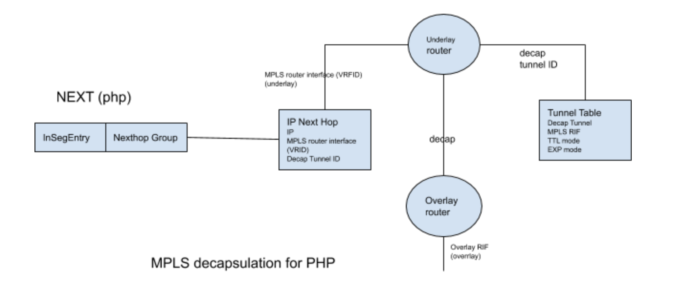
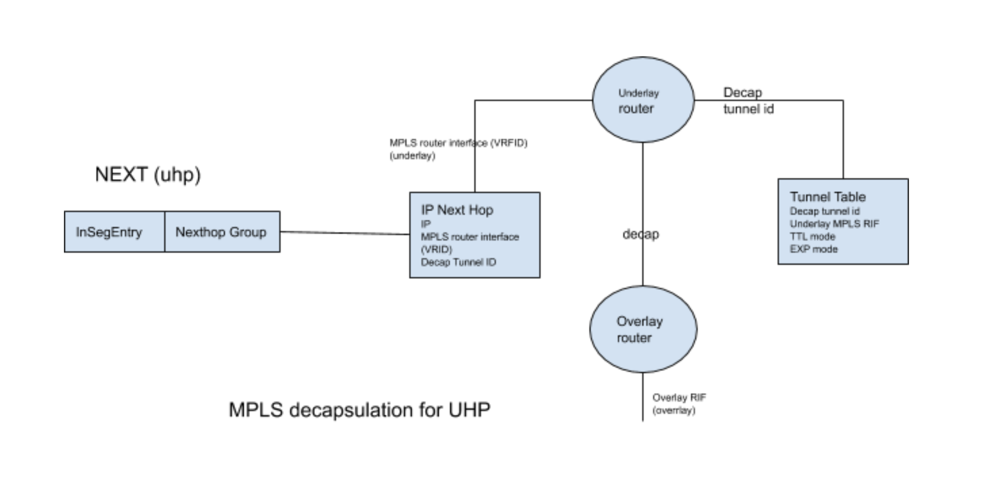
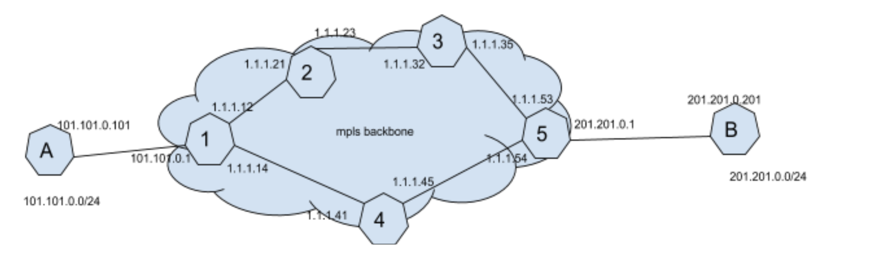

# SAI IP-in-MPLS tunnel proposal


-------------------------------------------------------------------------------
 Title       | SAI IP-in-MPLS tunnel proposal
-------------|-----------------------------------------------------------------
 Authors     | Parvez Shaikh, Facebook Inc.
 Status      | Under Review
 Type        | Standards track
 Created     | 03/23/2020
 Updated     |
 SAI-Version |

-------------------------------------------------------------------------------


## IP-in-MPLS network

To implement either L3-VPN over MPLS or Segment Routing over MPLS (SR-MPLS), IP packets must be injected in MPLS domain at ingress. This involves the process of encapsulating IP packets into MPLS packets. At egress, traffic is decapsulated and resulting IP (or MPLS) packets are either forwarded to next hop or routed based on destination IP address.

For encapsulation at ingress, MPLS header properties must be specified. Each MPLS header has 20-bit label, 8-bit TTL, a 3-bit QoS attribute  called either EXP or Traffic Class and 1-bit Bottom-of-Stack(BoS). Next Hop attribute SAI_NEXT_HOP_ATTR_LABELSTACK specifies Label Stack, a list of 20-bit label values. First label has BoS set while others have BoS reset. TTL and 3-bit EXP values needs to be derived. For decapsulation at egress, outgoing IP (or MPLS) header TTL and QoS attribute field will depend either on incoming TTL and QoS attribute or left unmodified.

### Encapsulation

For encapsulation at ingress, TTL and QoS attribute can be derived in two ways.

#### TTL treatment

TTL is first decremented in the incoming IP header. For TTL in outgoing MPLS header there are two options
1. Decremented IP TTL value is copied in the outgoing MPLS header - a uniform mode
1. A new TTL value is set in the outgoing MPLS header - a pipe mode

In Uniform Mode, SAI_TUNNEL_ATTR_ENCAP_TTL_MODE attribute will have SAI_TUNNEL_TTL_MODE_UNIFORM_MODEL value. TTL value of all outgoing MPLS labels will be set to one less than TTL of incoming packet.

In Pipe Mode, SAI_TUNNEL_ATTR_ENCAP_TTL_MODE attribute will have SAI_TUNNEL_TTL_MODE_PIPE_MODEL value.  TTL value of all outgoing MPLS labels will be set to a value given by SAI_TUNNEL_ATTR_ENCAP_TTL_VAL.

#### QoS treatment

For encapsulation at ingress, EXP in outgoing MPLS header can be derived in two way

1. DSCP in incoming IP header defines EXP value in the outgoing MPLS header - a uniform mode
1. A new EXP value is set in the outgoing MPLS header - a pipe mode

In Uniform Mode,
- PrefixSID : Incoming IP packet's DSCP will map to traffic class and color. A new QoS map type SAI_QOS_MAP_TYPE_TC_AND_COLOR_TO_EXP will map traffic class and color to EXP.
-  BindingSID : There're two types of MPLS tunnels are possible, E-LSP and L-LSP
   - E-LSP: EXP defines both traffic class and color. A new QoS map type SAI_QOS_MAP_TYPE_EXP_TO_TC and SAI_QOS_MAP_TYPE_EXP_TO_COLOR will map EXP to traffic class and color.
   - L-LSP: Here EXP maps to color but traffic class comes from label value. This requires an additional optional attribute in InSegEntry  for traffic class.

In Pipe Mode, tunnel ecapsulation attribute will provide MPLS EXP value.

### Decapsulation

For decapsulation at egress TTL and QoS attribute are handled in two ways

#### TTL treatment

TTL is first decremented in the incoming MPLS header. For TTL in the outgoing header (IP or MPLS) there are two options

1. Decremented MPLS TTL value is copied in the outgoing header - a uniform mode
1. TTL value in the exposed outgoing header is left untouched - a pipe mode

In Uniform Mode, SAI_TUNNEL_ATTR_DECAP_TTL_MODE attribute will have SAI_TUNNEL_TTL_MODE_UNIFORM_MODEL value. TTL value of exposed header will be set to one less than TTL of incoming packet.

In Pipe Mode, SAI_TUNNEL_ATTR_DECAP_TTL_MODE attribute will have SAI_TUNNEL_TTL_MODE_PIPE_MODEL value. TTL value of exposed header will be left untouched.

#### QoS treatment

For QoS attribute in the outgoing header there are two options

1. QoS attribute in the incoming header defines the QoS attribute in the outgoing header - a uniform mode
1. QoS attribute in the exposed header is left untouched - a pipe mode

In Uniform Mode, incoming MPLS label or EXP value will map to traffic class and color (as described above). Existing QoS map type SAI_QOS_MAP_TYPE_TC_AND_COLOR_TO_DSCP or a new QoS map type SAI_QOS_MAP_TYPE_TC_AND_COLOR_TO_EXP will decide outgoing IP packet's DSCP value or MPLS packet's EXP value.

In Pipe Mode, QoS attribute in the exposed header is left untouched.

## MPLS tunnel pipeline

MPLS tunnel attributes at ingress and egress nodes can define encapsulation and decapsulation behavior.

### Encapsulation

Encapsulation can happen for PrefixSID or BindingSID. In other words, at ingress node where IP traffic is encapsulated in MPLS traffic or at midpoint node where incoming label is swapped with more than one labels.


### Decapsulation

Decapsulation can happen either at penultimate hop or ultimate hop. At penultimate hop, incoming MPLS label defines the forwarding treatment. At ultimate hop, top label is discarded and exposed header defines forwarding treatment. If exposed header is MPLS, Incoming Label Map look up will define forwarding treatment. If exposed header is IP, Routing Table lookup will define forwarding treatment.

#### Decapsulation At Penultimate Hop



#### Decapsulation At Ultimate Hop



## SR-MPLS Network




- Routers A and B are connected through MPLS backbone.
- Nodes 1 - 5 are MPLS switches.
- Node 1 and Node 5 are also edge routers.
- Prefixes are advertised by A and B.
- Every MPLS node has NodeSID with its own ID as shown.
- There are two PrefixSIDs for 201.201.0.0/24,
  1. 5 (same as NodeSID)
  2. 201.
- There are two PrefixSIDs for 101.101.0.0/24,
  1. 1 (same as NodeSID)
  2. 101.
- Two Segments to reach from A to B are
  1. [5, 3]
  2. [201]
- Two Segments to reach from B to A are
  1. [1, 2]
  2. [101]

For a path A-1-2-3-5-B  and  B-5-3-2-1-A
1. Node 1 programs label stack [5, 3] (with 5 as BoS) and forwards packet to node 2 (PUSH).
2. Node 1 also programs label 1 for UHP (NEXT)
3. Node 2 swaps label 3 with label 3 (CONTINUE)
4. Node 2 also programs label 2 for UHP(NEXT)
5. Node 3 programs label 3 for UHP (NEXT)
6. Node 5 programs label 5 for  UHP (NEXT)
7. Node 5 also programs label stack [1, 2] (with 1 as BoS) and forwards packet to node 3(PUSH)

For a path A-1-4-5-B and B-5-4-1-A
1. Node 1 programs label stack [201] (with 201 as BoS) and forwards packet to node 4(PUSH)
2. Node 1 also programs label 101 for UHP (NEXT)
3. Noose 4 performs PHP for label 101 and label 201 and forward to Node 1 and Node 5 respectively (NEXT)
4. Node 5 programs label stack [101] (with 101 as BoS) and forwards packet to node 4(PUSH)
5. Node 5 also programs label 201 for UHP(NEXT)

Below is SAI configuration at each node to achieve this.

## Node Configuration

### Node 1 configuration

#### router interfaces

```
rif_1_a = {
    {SAI_ROUTER_INTERFACE_ATTR_VIRTUAL_ROUTER_ID, vr0},
    {SAI_ROUTER_INTERFACE_ATTR_TYPE, SAI_ROUTER_INTERFACE_TYPE_VLAN},
    {SAI_ROUTER_INTERFACE_ATTR_VLAN_ID, vlan_1_a},
    {SAI_ROUTER_INTERFACE_ATTR_SRC_MAC_ADDRESS, router1_mac},
}
rif_1_2 = {
    {SAI_ROUTER_INTERFACE_ATTR_VIRTUAL_ROUTER_ID, vr0},
    {SAI_ROUTER_INTERFACE_ATTR_TYPE, SAI_ROUTER_INTERFACE_TYPE_VLAN},
    {SAI_ROUTER_INTERFACE_ATTR_VLAN_ID, vlan_1_2},
    {SAI_ROUTER_INTERFACE_ATTR_SRC_MAC_ADDRESS, router1_mac},
}
rif_1_4 = {
    {SAI_ROUTER_INTERFACE_ATTR_VIRTUAL_ROUTER_ID, vr0},
    {SAI_ROUTER_INTERFACE_ATTR_TYPE, SAI_ROUTER_INTERFACE_TYPE_VLAN},
    {SAI_ROUTER_INTERFACE_ATTR_VLAN_ID, vlan_1_4},
    {SAI_ROUTER_INTERFACE_ATTR_SRC_MAC_ADDRESS, router1_mac},
}
mpls_rif = {
    {SAI_ROUTER_INTERFACE_ATTR_VIRTUAL_ROUTER_ID, vr0},
    {SAI_ROUTER_INTERFACE_ATTR_TYPE, SAI_ROUTER_INTERFACE_TYPE_MPLS_ROUTER},
}
```


#### fdb entries

```
fdb_a = {
    {switch_id, vlan_1_a, mac_a},
    {
        {SAI_FDB_ENTRY_ATTR_TYPE, SAI_FDB_ENTRY_TYPE_STATIC},
        {SAI_FDB_ENTRY_ATTR_BRIDGE_PORT_ID, port_1_a}
    }
}
fdb_2 = {
    {switch, vlan_1_2, mac_2},
    {
        {SAI_FDB_ENTRY_ATTR_TYPE, SAI_FDB_ENTRY_TYPE_STATIC},
        {SAI_FDB_ENTRY_ATTR_BRIDGE_PORT_ID, port_1_2}
    }
}
fdb_4 = {
    {switch, vlan_1_4, mac_4},
    {
        {SAI_FDB_ENTRY_ATTR_TYPE, SAI_FDB_ENTRY_TYPE_STATIC},
        {SAI_FDB_ENTRY_ATTR_BRIDGE_PORT_ID, port_1_4}
    }
}
```

#### neighbor entries

```
neighbor_a = {
    {switch_id, rif_1_a, 101.101.0.101},
    {
        {SAI_NEIGHBOR_ENTRY_ATTR_DST_MAC_ADDRESS, mac_a}
    }
}
neighbor_2 = {
    {switch_id, rif_1_2, 1.1.1.21},
    {
        {SAI_NEIGHBOR_ENTRY_ATTR_DST_MAC_ADDRESS, mac_2},
    }
}
neighbor_4 = {
    {switch_id, rif_1_4, 1.1.1.41},
    {
        {SAI_NEIGHBOR_ENTRY_ATTR_DST_MAC_ADDRESS, mac_4}
    }
}
```

#### decap tunnel

```
decap_tunnel = {
    {SAI_TUNNEL_ATTR_TYPE, SAI_TUNNEL_TYPE_MPLS},
    {SAI_TUNNEL_ATTR_UNDERLAY_INTERFACE, mpls_rif},
    {SAI_TUNNEL_ATTR_DECAP_TTL_MODE, SAI_TUNNEL_TTL_MODE_UNIFORM_MODEL},
    {SAI_TUNNEL_ATTR_DECAP_EXP_MODE, SAI_TUNNEL_EXP_MODE_UNIFORM_MODEL},
}
```

#### encap tunnel

```
encap_tunnel = {
    {SAI_TUNNEL_ATTR_TYPE, SAI_TUNNEL_TYPE_MPLS},
    {SAI_TUNNEL_ATTR_ENCAP_TTL_MODE, SAI_TUNNEL_TTL_MODE_UNIFORM_MODEL},
    {SAI_TUNNEL_ATTR_ENCAP_EXP_MODE, SAI_TUNNEL_EXP_MODE_UNIFORM_MODEL},
}
```

#### next hops

```
nh_a = {
    {SAI_NEXT_HOP_ATTR_TYPE, SAI_NEXT_HOP_TYPE_IP},
    {SAI_NEXT_HOP_ATTR_IP, "101.101.0.101"},
    {SAI_NEXT_HOP_ATTR_ROUTER_INTERFACE_ID, rif_1_a},
}
nh_2 = {
    {SAI_NEXT_HOP_ATTR_TYPE, SAI_NEXT_HOP_TYPE_MPLS},
    {SAI_NEXT_HOP_ATTR_IP, "1.1.1.21"},
    {SAI_NEXT_HOP_ATTR_ROUTER_INTERFACE_ID, rif_1_2},
    {SAI_NEXT_HOP_ATTR_LABELSTACK, [5, 3]},
    {SAI_NEXT_HOP_ATTR_MPLS_ENCAP_TUNNEL_ID, encap_tunnel}
}
nh_4 = {
    {SAI_NEXT_HOP_ATTR_TYPE, SAI_NEXT_HOP_TYPE_MPLS},
    {SAI_NEXT_HOP_ATTR_IP, "1.1.1.41"},
    {SAI_NEXT_HOP_ATTR_ROUTER_INTERFACE_ID, rif_1_4},
    {SAI_NEXT_HOP_ATTR_LABELSTACK, [201]},
    {SAI_NEXT_HOP_ATTR_MPLS_ENCAP_TUNNEL_ID, encap_tunnel}
}
nhg201 = {
    {SAI_NEXT_HOP_GROUP_ATTR_NEXT_HOP_COUNT, 2},
    {SAI_NEXT_HOP_GROUP_ATTR_NEXT_HOP_MEMBER_LIST, [nh_2, nh_4]},
    {SAI_NEXT_HOP_GROUP_ATTR_TYPE, SAI_NEXT_HOP_GROUP_TYPE_ECMP}
}
```

#### routes

```
route201 = {
    {switch_id, vr0, "201.201.0.0/24"},
    {SAI_ROUTE_ENTRY_ATTR_NEXT_HOP_ID, nhg201}
}
route101 = {
    {switch_id, vr0, "101.101.0.0/24"},
    {SAI_ROUTE_ENTRY_ATTR_NEXT_HOP_ID, nh_a}
}
```

##### inseg entries

```
inseg1 = {
   {switch_id, 1},
   {SAI_INSEG_ENTRY_ATTR_NUM_OF_POP, 1},
   {SAI_INSEG_ENTRY_ATTR_NEXT_HOP_ID, mpls_rif}
}
inseg101 = {
   {switch_id, 101},
   {SAI_INSEG_ENTRY_ATTR_NUM_OF_POP, 1},
   {SAI_INSEG_ENTRY_ATTR_NEXT_HOP_ID, mpls_rif}
}
```

### Node 2 configuration

#### router interfaces

```
rif_2_1 = {
   {SAI_ROUTER_INTERFACE_ATTR_VIRTUAL_ROUTER_ID, vr0},
   {SAI_ROUTER_INTERFACE_ATTR_TYPE, SAI_ROUTER_INTERFACE_TYPE_VLAN},
   {SAI_ROUTER_INTERFACE_ATTR_VLAN_ID, vlan_2_1},
   {SAI_ROUTER_INTERFACE_ATTR_SRC_MAC_ADDRESS, router2_mac},
}
rif_2_3 = {
   {SAI_ROUTER_INTERFACE_ATTR_VIRTUAL_ROUTER_ID, vr0},
   {SAI_ROUTER_INTERFACE_ATTR_TYPE, SAI_ROUTER_INTERFACE_TYPE_VLAN},
   {SAI_ROUTER_INTERFACE_ATTR_VLAN_ID, vlan_2_3},
   {SAI_ROUTER_INTERFACE_ATTR_SRC_MAC_ADDRESS, router2_mac},
}
mpls_rif = {
   {SAI_ROUTER_INTERFACE_ATTR_VIRTUAL_ROUTER_ID, vr0},
   {SAI_ROUTER_INTERFACE_ATTR_TYPE, SAI_ROUTER_INTERFACE_TYPE_MPLS_ROUTER},
}
```

#### fdb entries

```
fdb_1 = {
   {switch, vlan_2_1, mac_1},
   {
       {SAI_FDB_ENTRY_ATTR_TYPE, SAI_FDB_ENTRY_TYPE_STATIC},
       {SAI_FDB_ENTRY_ATTR_BRIDGE_PORT_ID, port_2_1}
   }
}
fdb_3 = {
   {switch, vlan_2_3, mac_3},
   {
       {SAI_FDB_ENTRY_ATTR_TYPE, SAI_FDB_ENTRY_TYPE_STATIC},
       {SAI_FDB_ENTRY_ATTR_BRIDGE_PORT_ID, port_2_3}
   }
}
```

#### neighbor entries

```
neighbor_1 = {
   {switch_id, rif_2_1, 1.1.1.12},
   {
       {SAI_NEIGHBOR_ENTRY_ATTR_DST_MAC_ADDRESS, mac_1},
   }
}
neighbor_3 = {
   {switch_id, rif_2_3_, 1.1.1.32},
   {
       {SAI_NEIGHBOR_ENTRY_ATTR_DST_MAC_ADDRESS, mac_3}
   }
}
```

#### decap tunnel

```
decap_tunnel = {
   {SAI_TUNNEL_ATTR_TYPE, SAI_TUNNEL_TYPE_MPLS},
   {SAI_TUNNEL_ATTR_UNDERLAY_INTERFACE, mpls_rif},
   {SAI_TUNNEL_ATTR_DECAP_TTL_MODE, SAI_TUNNEL_TTL_MODE_UNIFORM_MODEL},
   {SAI_TUNNEL_ATTR_DECAP_EXP_MODE, SAI_TUNNEL_EXP_MODE_UNIFORM_MODEL},
}
```

#### next hops

```
nh_1 = {
   {SAI_NEXT_HOP_ATTR_TYPE, SAI_NEXT_HOP_TYPE_MPLS},
   {SAI_NEXT_HOP_ATTR_IP, "1.1.1.12"},
   {SAI_NEXT_HOP_ATTR_LABELSTACK, [1]},
   {SAI_NEXT_HOP_ATTR_ROUTER_INTERFACE_ID, rif_2_1},
}
nh_3 = {
   {SAI_NEXT_HOP_ATTR_TYPE, SAI_NEXT_HOP_TYPE_MPLS},
   {SAI_NEXT_HOP_ATTR_IP, "1.1.1.32"},
   {SAI_NEXT_HOP_ATTR_LABELSTACK, [3]},
   {SAI_NEXT_HOP_ATTR_ROUTER_INTERFACE_ID, rif_2_3},
}
```

#### inseg entries

```
inseg2 = {
  {switch_id, 2},
  {SAI_INSEG_ENTRY_ATTR_NUM_OF_POP, 1},
  {SAI_INSEG_ENTRY_ATTR_NEXT_HOP_ID, mpls_rif}
}
inseg1 = {
  {switch_id, 1},
  {SAI_INSEG_ENTRY_ATTR_NUM_OF_POP, 1},
  {SAI_INSEG_ENTRY_ATTR_NEXT_HOP_ID, nh_1}
}
inseg3 = {
  {switch_id, 3},
  {SAI_INSEG_ENTRY_ATTR_NUM_OF_POP, 1},
  {SAI_INSEG_ENTRY_ATTR_NEXT_HOP_ID, nh_3}
}
```

### Node 3 configuration

#### router interfaces

```
rif_3_2 = {
   {SAI_ROUTER_INTERFACE_ATTR_VIRTUAL_ROUTER_ID, vr0},
   {SAI_ROUTER_INTERFACE_ATTR_TYPE, SAI_ROUTER_INTERFACE_TYPE_VLAN},
   {SAI_ROUTER_INTERFACE_ATTR_VLAN_ID, vlan_3_2},
   {SAI_ROUTER_INTERFACE_ATTR_SRC_MAC_ADDRESS, router3_mac},
}
rif_3_5 = {
   {SAI_ROUTER_INTERFACE_ATTR_VIRTUAL_ROUTER_ID, vr0},
   {SAI_ROUTER_INTERFACE_ATTR_TYPE, SAI_ROUTER_INTERFACE_TYPE_VLAN},
   {SAI_ROUTER_INTERFACE_ATTR_VLAN_ID, vlan_3_5},
   {SAI_ROUTER_INTERFACE_ATTR_SRC_MAC_ADDRESS, router3_mac},
}
mpls_rif = {
   {SAI_ROUTER_INTERFACE_ATTR_VIRTUAL_ROUTER_ID, vr0},
   {SAI_ROUTER_INTERFACE_ATTR_TYPE, SAI_ROUTER_INTERFACE_TYPE_MPLS_ROUTER},
}
```

#### fdb entries

```
fdb_2 = {
   {switch, vlan_3_2, mac_2},
   {
       {SAI_FDB_ENTRY_ATTR_TYPE, SAI_FDB_ENTRY_TYPE_STATIC},
       {SAI_FDB_ENTRY_ATTR_BRIDGE_PORT_ID, port_3_2}
   }
}
fdb_5 = {
   {switch, vlan_3_5, mac_5},
   {
       {SAI_FDB_ENTRY_ATTR_TYPE, SAI_FDB_ENTRY_TYPE_STATIC},
       {SAI_FDB_ENTRY_ATTR_BRIDGE_PORT_ID, port_3_5}
   }
}
```

#### neighbor entries

```
neighbor_2 = {
   {switch_id, rif_3_2, 1.1.1.23},
   {
       {SAI_NEIGHBOR_ENTRY_ATTR_DST_MAC_ADDRESS, mac_2},
   }
}
neighbor_5 = {
   {switch_id, rif_1_4, 1.1.1.53},
   {
       {SAI_NEIGHBOR_ENTRY_ATTR_DST_MAC_ADDRESS, mac_5}
   }
}
```

#### decap tunnel

```
decap_tunnel = {
   {SAI_TUNNEL_ATTR_TYPE, SAI_TUNNEL_TYPE_MPLS},
   {SAI_TUNNEL_ATTR_UNDERLAY_INTERFACE, mpls_rif},
   {SAI_TUNNEL_ATTR_DECAP_TTL_MODE, SAI_TUNNEL_TTL_MODE_UNIFORM_MODEL},
   {SAI_TUNNEL_ATTR_DECAP_EXP_MODE, SAI_TUNNEL_EXP_MODE_UNIFORM_MODEL},
}
```

#### next hops

```
nh_2 = {
   {SAI_NEXT_HOP_ATTR_TYPE, SAI_NEXT_HOP_TYPE_MPLS},
   {SAI_NEXT_HOP_ATTR_IP, "1.1.1.32"},
   {SAI_NEXT_HOP_ATTR_LABELSTACK, [2]},
   {SAI_NEXT_HOP_ATTR_ROUTER_INTERFACE_ID, rif_3_2},
}
nh_5 = {
   {SAI_NEXT_HOP_ATTR_TYPE, SAI_NEXT_HOP_TYPE_MPLS},
   {SAI_NEXT_HOP_ATTR_IP, "1.1.1.53"},
   {SAI_NEXT_HOP_ATTR_LABELSTACK, [5]},
   {SAI_NEXT_HOP_ATTR_ROUTER_INTERFACE_ID, rif_3_5},
}
```

#### inseg entries

```
inseg3 = {
  {switch_id, 3},
  {SAI_INSEG_ENTRY_ATTR_NUM_OF_POP, 1},
  {SAI_INSEG_ENTRY_ATTR_NEXT_HOP_ID, mpls_rif}
}
inseg5 = {
  {switch_id, 5},
  {SAI_INSEG_ENTRY_ATTR_NUM_OF_POP, 1},
  {SAI_INSEG_ENTRY_ATTR_NEXT_HOP_ID, nh_5}
}
inseg2 = {
  {switch_id, 2},
  {SAI_INSEG_ENTRY_ATTR_NUM_OF_POP, 1},
  {SAI_INSEG_ENTRY_ATTR_NEXT_HOP_ID, nh_2}
}
```

### Node 4 configuration

#### router interfaces

```
rif_4_1 = {
  {SAI_ROUTER_INTERFACE_ATTR_VIRTUAL_ROUTER_ID, vr0},
  {SAI_ROUTER_INTERFACE_ATTR_TYPE, SAI_ROUTER_INTERFACE_TYPE_VLAN},
  {SAI_ROUTER_INTERFACE_ATTR_VLAN_ID, vlan_4_1},
  {SAI_ROUTER_INTERFACE_ATTR_SRC_MAC_ADDRESS, router4_mac},
}
rif_4_5 = {
  {SAI_ROUTER_INTERFACE_ATTR_VIRTUAL_ROUTER_ID, vr0},
  {SAI_ROUTER_INTERFACE_ATTR_TYPE, SAI_ROUTER_INTERFACE_TYPE_VLAN},
  {SAI_ROUTER_INTERFACE_ATTR_VLAN_ID, vlan_4_5},
  {SAI_ROUTER_INTERFACE_ATTR_SRC_MAC_ADDRESS, router4_mac},
}
mpls_rif = {
  {SAI_ROUTER_INTERFACE_ATTR_VIRTUAL_ROUTER_ID, vr0},
  {SAI_ROUTER_INTERFACE_ATTR_TYPE, SAI_ROUTER_INTERFACE_TYPE_MPLS_ROUTER},
}
```

#### fdb entries

```
fdb_1 = {
  {switch, vlan_4_1, mac_1},
  {
      {SAI_FDB_ENTRY_ATTR_TYPE, SAI_FDB_ENTRY_TYPE_STATIC},
      {SAI_FDB_ENTRY_ATTR_BRIDGE_PORT_ID, port_4_1}
  }
}
fdb_5 = {
  {switch, vlan_4_5, mac_5},
  {
      {SAI_FDB_ENTRY_ATTR_TYPE, SAI_FDB_ENTRY_TYPE_STATIC},
      {SAI_FDB_ENTRY_ATTR_BRIDGE_PORT_ID, port_4_5}
  }
}
```

#### neighbor entries

```
neighbor_2 = {
  {switch_id, rif_4_1, 1.1.1.14},
  {
      {SAI_NEIGHBOR_ENTRY_ATTR_DST_MAC_ADDRESS, mac_2},
  }
}
neighbor_5 = {
  {switch_id, rif_4_5, 1.1.1.54},
  {
      {SAI_NEIGHBOR_ENTRY_ATTR_DST_MAC_ADDRESS, mac_5}
  }
}
```

#### decap tunnel

```
decap_tunnel = {
  {SAI_TUNNEL_ATTR_TYPE, SAI_TUNNEL_TYPE_MPLS},
  {SAI_TUNNEL_ATTR_UNDERLAY_INTERFACE, mpls_rif},
  {SAI_TUNNEL_ATTR_DECAP_TTL_MODE, SAI_TUNNEL_TTL_MODE_UNIFORM_MODEL},
  {SAI_TUNNEL_ATTR_DECAP_EXP_MODE, SAI_TUNNEL_EXP_MODE_UNIFORM_MODEL},
}
```

#### next hops

```
nh_101_1 = {
  {SAI_NEXT_HOP_ATTR_TYPE, SAI_NEXT_HOP_TYPE_IP},
  {SAI_NEXT_HOP_ATTR_IP, "1.1.1.14"},
  {SAI_NEXT_HOP_ATTR_ROUTER_INTERFACE_ID, rif_4_1},
}
nh_201_5 = {
  {SAI_NEXT_HOP_ATTR_TYPE, SAI_NEXT_HOP_TYPE_IP},
  {SAI_NEXT_HOP_ATTR_IP, "1.1.1.54"},
  {SAI_NEXT_HOP_ATTR_ROUTER_INTERFACE_ID, rif_4_5},
}
```

#### inseg entries

```
inseg4 = {
 {switch_id, 4},
 {SAI_INSEG_ENTRY_ATTR_NUM_OF_POP, 1},
 {SAI_INSEG_ENTRY_ATTR_NEXT_HOP_ID, mpls_rif}
}
inseg101 = {
 {switch_id, 101},
 {SAI_INSEG_ENTRY_ATTR_NUM_OF_POP, 1},
 {SAI_INSEG_ENTRY_ATTR_NEXT_HOP_ID, nh_101_1},
 {SAI_INSEG_ENTRY_ATTR_DECAP_TUNNEL_ID, decap_tunnel}
}
inseg201 = {
 {switch_id, 201},
 {SAI_INSEG_ENTRY_ATTR_NUM_OF_POP, 1},
 {SAI_INSEG_ENTRY_ATTR_NEXT_HOP_ID, nh_201_5},
 {SAI_INSEG_ENTRY_ATTR_DECAP_TUNNEL_ID, decap_tunnel}
}
```

### Node 5 configuration

#### router interfaces

```
rif_5_a = {
   {SAI_ROUTER_INTERFACE_ATTR_VIRTUAL_ROUTER_ID, vr0},
   {SAI_ROUTER_INTERFACE_ATTR_TYPE, SAI_ROUTER_INTERFACE_TYPE_VLAN},
   {SAI_ROUTER_INTERFACE_ATTR_VLAN_ID, vlan_5_a},
   {SAI_ROUTER_INTERFACE_ATTR_SRC_MAC_ADDRESS, router5_mac},
}
rif_5_3 = {
   {SAI_ROUTER_INTERFACE_ATTR_VIRTUAL_ROUTER_ID, vr0},
   {SAI_ROUTER_INTERFACE_ATTR_TYPE, SAI_ROUTER_INTERFACE_TYPE_VLAN},
   {SAI_ROUTER_INTERFACE_ATTR_VLAN_ID, vlan_5_3},
   {SAI_ROUTER_INTERFACE_ATTR_SRC_MAC_ADDRESS, router5_mac},
}
rif_5_4 = {
   {SAI_ROUTER_INTERFACE_ATTR_VIRTUAL_ROUTER_ID, vr0},
   {SAI_ROUTER_INTERFACE_ATTR_TYPE, SAI_ROUTER_INTERFACE_TYPE_VLAN},
   {SAI_ROUTER_INTERFACE_ATTR_VLAN_ID, vlan_5_4},
   {SAI_ROUTER_INTERFACE_ATTR_SRC_MAC_ADDRESS, router5_mac},
}
mpls_rif = {
   {SAI_ROUTER_INTERFACE_ATTR_VIRTUAL_ROUTER_ID, vr0},
   {SAI_ROUTER_INTERFACE_ATTR_TYPE, SAI_ROUTER_INTERFACE_TYPE_MPLS_ROUTER},
}
```

#### fdb entries

```
fdb_b = {
   {switch_id, vlan_5_b, mac_a},
   {
       {SAI_FDB_ENTRY_ATTR_TYPE, SAI_FDB_ENTRY_TYPE_STATIC},
       {SAI_FDB_ENTRY_ATTR_BRIDGE_PORT_ID, port_5_b}
   }
}
fdb_3 = {
   {switch, vlan_5_3, mac_3},
   {
       {SAI_FDB_ENTRY_ATTR_TYPE, SAI_FDB_ENTRY_TYPE_STATIC},
       {SAI_FDB_ENTRY_ATTR_BRIDGE_PORT_ID, port_5_3}
   }
}
fdb_4 = {
   {switch, vlan_5_4, mac_4},
   {
       {SAI_FDB_ENTRY_ATTR_TYPE, SAI_FDB_ENTRY_TYPE_STATIC},
       {SAI_FDB_ENTRY_ATTR_BRIDGE_PORT_ID, port_5_4}
   }
}
```

#### neighbor entries

```
neighbor_b = {
   {switch_id, rif_1_b, 201.201.0.201},
   {
       {SAI_NEIGHBOR_ENTRY_ATTR_DST_MAC_ADDRESS, mac_b}
   }
}
neighbor_3 = {
   {switch_id, rif_5_3, 1.1.1.35},
   {
       {SAI_NEIGHBOR_ENTRY_ATTR_DST_MAC_ADDRESS, mac_3},
   }
}
neighbor_4 = {
   {switch_id, rif_5_4, 1.1.1.45},
   {
       {SAI_NEIGHBOR_ENTRY_ATTR_DST_MAC_ADDRESS, mac_4}
   }
}
```

#### decap tunnel

```
decap_tunnel = {
   {SAI_TUNNEL_ATTR_TYPE, SAI_TUNNEL_TYPE_MPLS},
   {SAI_TUNNEL_ATTR_UNDERLAY_INTERFACE, mpls_rif},
   {SAI_TUNNEL_ATTR_DECAP_TTL_MODE, SAI_TUNNEL_TTL_MODE_UNIFORM_MODEL},
   {SAI_TUNNEL_ATTR_DECAP_EXP_MODE, SAI_TUNNEL_EXP_MODE_UNIFORM_MODEL},
}
```

#### encap tunnel

```
encap_tunnel = {
   {SAI_TUNNEL_ATTR_TYPE, SAI_TUNNEL_TYPE_MPLS},
   {SAI_TUNNEL_ATTR_UNDERLAY_INTERFACE, mpls_rif},
   {SAI_TUNNEL_ATTR_DECAP_TTL_MODE, SAI_TUNNEL_TTL_MODE_UNIFORM_MODEL},
   {SAI_TUNNEL_ATTR_DECAP_EXP_MODE, SAI_TUNNEL_EXP_MODE_UNIFORM_MODEL},
}
```

#### next hops

```
nh_b = {
   {SAI_NEXT_HOP_ATTR_TYPE, SAI_NEXT_HOP_TYPE_IP},
   {SAI_NEXT_HOP_ATTR_IP, "201.201.0.201"},
   {SAI_NEXT_HOP_ATTR_ROUTER_INTERFACE_ID, rif_5_b},
}
nh_3 = {
   {SAI_NEXT_HOP_ATTR_TYPE, SAI_NEXT_HOP_TYPE_MPLS},
   {SAI_NEXT_HOP_ATTR_IP, "1.1.1.35"},
   {SAI_NEXT_HOP_ATTR_ROUTER_INTERFACE_ID, rif_5_3},
   {SAI_NEXT_HOP_ATTR_LABELSTACK, [1, 2]},
   {SAI_NEXT_HOP_ATTR_MPLS_ENCAP_TUNNEL_ID, encap_tunnel}
}
nh_4 = {
   {SAI_NEXT_HOP_ATTR_TYPE, SAI_NEXT_HOP_TYPE_MPLS},
   {SAI_NEXT_HOP_ATTR_IP, "1.1.1.45"},
   {SAI_NEXT_HOP_ATTR_ROUTER_INTERFACE_ID, rif_5_4},
   {SAI_NEXT_HOP_ATTR_LABELSTACK, [101]},
   {SAI_NEXT_HOP_ATTR_MPLS_ENCAP_TUNNEL_ID, encap_tunnel}
}
nhg101 = {
   {SAI_NEXT_HOP_GROUP_ATTR_NEXT_HOP_COUNT, 2},
   {SAI_NEXT_HOP_GROUP_ATTR_NEXT_HOP_MEMBER_LIST, [nh_3, nh_4]},
   {SAI_NEXT_HOP_GROUP_ATTR_TYPE, SAI_NEXT_HOP_GROUP_TYPE_ECMP}
}
```

#### routes

```
route201 = {
   {switch_id, vr0, "101.101.0.0/24"},
   {SAI_ROUTE_ENTRY_ATTR_NEXT_HOP_ID, nhg101}
}
route201 = {
   {switch_id, vr0, "201.201.0.0/24"},
   {SAI_ROUTE_ENTRY_ATTR_NEXT_HOP_ID, nh_b}
}
```

#### inseg entries

```
inseg1 = {
  {switch_id, 5},
  {SAI_INSEG_ENTRY_ATTR_NUM_OF_POP, 1},
  {SAI_INSEG_ENTRY_ATTR_NEXT_HOP_ID, mpls_rif}
}
inseg201 = {
  {switch_id, 201},
  {SAI_INSEG_ENTRY_ATTR_NUM_OF_POP, 1},
  {SAI_INSEG_ENTRY_ATTR_NEXT_HOP_ID, mpls_rif}
}
```
