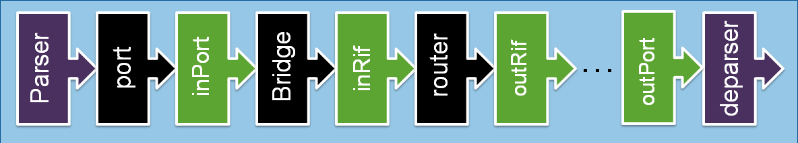

This is a backend for p4_16 compiler [p4c](https://github.com/p4lang/p4c/).
This backends compiles p4_16 programs into SAI headers, and should be acommpanied with a vendor provided backend for the SAI adapter implementation. This should allow for easy integration of new programmable pipelines with SAI supporting NOS, like SONiC.

#  SAI target
This repo defines the SAI target architecture, which consists of a parser, deparser and 4 programable pipelines, in between fixed pipelines, which are defined in accordance with [SAI behvaioral model](https://github.com/opencomputeproject/SAI/tree/master/doc/behavioral%20model):

here black boxes are fixed pipelines, and green ones are programmable.


The archtiecture defines the pipelines, and also SAI headers, metadata available at each stage, and the externs (actions which are supported by a SAI target), which can all be seen in [p4include](backend/json_stage/p4include)
# Install instructions for sai p4_16 backend
  
Following:  [p4c build instructions](https://github.com/p4lang/p4c/edit/master/README.md).

## clone p4c repo, with the following branch
```
git clone https://github.com/p4lang/p4c.git  
git checkout 6d265b2d15b927db522c08f36a60fe23784e8357
git submodule update --init --recursive
```

## link sai p4 compiler extention
2. in p4c/extensions (make new dir if needed)
 '''ln -s <sai_p4_compiler_git_path>/backend/ sai'''

## Build. 
Building should also take place in a subdirectory named `build`.  
 in p4c repo:
    
    ./bootstrap.sh 

    [optional: remove all other backends by adding -DENABLE_BMV2=OFF -DENABLE_EBPF=OFF -DENABLE_P4TEST=OFF -DENABLE_P4C_GRAPHS=OFF to cmake in bootstrap.sh]	

	cd build
	make -j4
    sudo make install

# creating a p4 program:
Coding a p4 program, should be done according to the languange specifications, as published in the [official website](https://p4.org/).
One can write Match-action tables to each one of the 4 programable piplines, according to sai_model.p4, and the defined target architecture.

One example, is given in [p4src](p4src)

# compile P4 program:  
p4c-sai PATH_TO_P4 -o OUTPUT_JSON 
(all output will go in the same dir as json)
e.g., compiling example.p4:  
```
mkdir -p sai_p4_compiler/output/example
p4c-sai sai_p4_compiler/p4src/example/example.p4 -o sai_p4_compiler/output/example/example.json
```
all output will be spilled to sai_p4_compiler/output/example/
