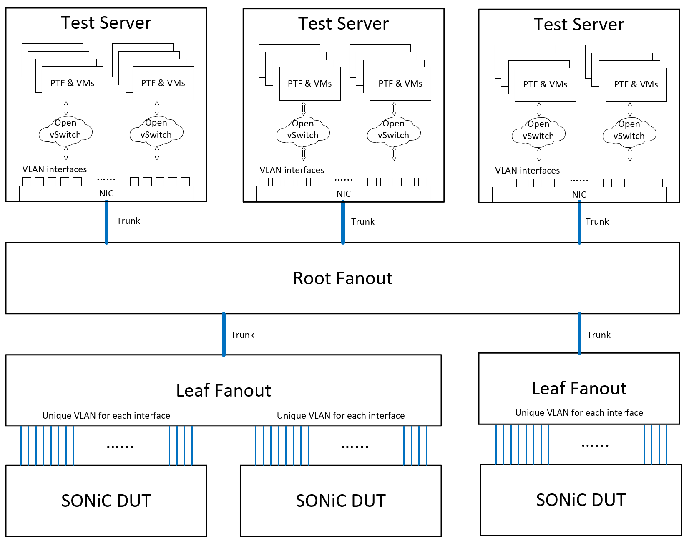

# Example: Physical Connection

*In this article, you will get to know the physical connection of the testbed by an example.*

- [Example: Physical Connection](#example-physical-connection)
  - [Key Components](#key-components)
  - [Physical Connection](#physical-connection)
  - [Vlan definition](#vlan-definition)

This example follows the [Testbed Setting (the third config)](https://github.com/sonic-net/sonic-mgmt/blob/master/ansible/testbed.csv#L4) and [Connection Graph](https://github.com/sonic-net/sonic-mgmt/commit/005d792675bbd21184534089d41e2be7e60c2735).

## Key Components
The physical connection of the testbed is designed like below:



Key components in the physical connection:

- Test servers
- Test Servers: `dev-acs-serv-01`
- Fanout Switches
  - Root Fanout Switch (optional): `dev-7260-11`
  - Leaf Fanout Switch: `dev-7260-10`
- SONiC DUT: `dev-msn2700-01`

## Physical Connection
Datastream from SONiC DUT to Test Server: 

1. From SONiC DUT (`dev-msn2700-01`) to Leaf Fanout (`dev-7260-10`), there are 32 connections:

    ```xml
    <DeviceInterfaceLink BandWidth="40000" EndDevice="dev-7260-10" EndPort="Ethernet1" StartDevice="dev-msn2700-01" StartPort="Ethernet0"/>
    <DeviceInterfaceLink BandWidth="40000" EndDevice="dev-7260-10" EndPort="Ethernet2" StartDevice="dev-msn2700-01" StartPort="Ethernet4"/>
    ...
    <DeviceInterfaceLink BandWidth="40000" EndDevice="dev-7260-10" EndPort="Ethernet32" StartDevice="dev-msn2700-01" StartPort="Ethernet124"/>
    ```

2. From Leaf Fanout (`dev-7260-10`) to Root Fanout (`dev-7260-11`):

    ```xml
    <DeviceInterfaceLink BandWidth="40000" EndDevice="dev-7260-10" EndPort="Ethernet64" StartDevice="dev-7260-11" StartPort="Ethernet30"/>
    ```

3. From Root Fanout (`dev-7260-11`) to Test Servers (`dev-acs-serv-01`):

    ```xml
    <DeviceInterfaceLink BandWidth="40000" EndDevice="dev-acs-serv-01" EndPort="p4p1" StartDevice="dev-7260-11" StartPort="Ethernet19"/>
    ```

## Vlan definition
There is a unique VLAN for each interface in the leaf fanout switch. By setting `InterfaceVlan.vlanids` correctly, the datastream is established between two specific devices: SONiC DUT (`dev-msn2700-01`) and Test Servers (`dev-acs-serv-01`). 

```xml
<DevicesL2Info Hostname="dev-7260-10">
    <InterfaceVlan mode="Access" portname="Ethernet1" vlanids="1681"/>
    <InterfaceVlan mode="Access" portname="Ethernet2" vlanids="1682"/>
    ...
    <InterfaceVlan mode="Access" portname="Ethernet23" vlanids="1703"/>
    <InterfaceVlan mode="Access" portname="Ethernet32" vlanids="1712"/>
    <InterfaceVlan mode="Trunk" portname="Ethernet64" vlanids="1681-1712"/>
</DevicesL2Info>
```

```xml
<DevicesL2Info Hostname="dev-7260-11">
    <InterfaceVlan mode="Trunk" portname="Ethernet19" vlanids=""/>
    <InterfaceVlan mode="Trunk" portname="Ethernet30" vlanids="1681-1712"/>
</DevicesL2Info>
```
